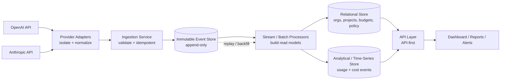
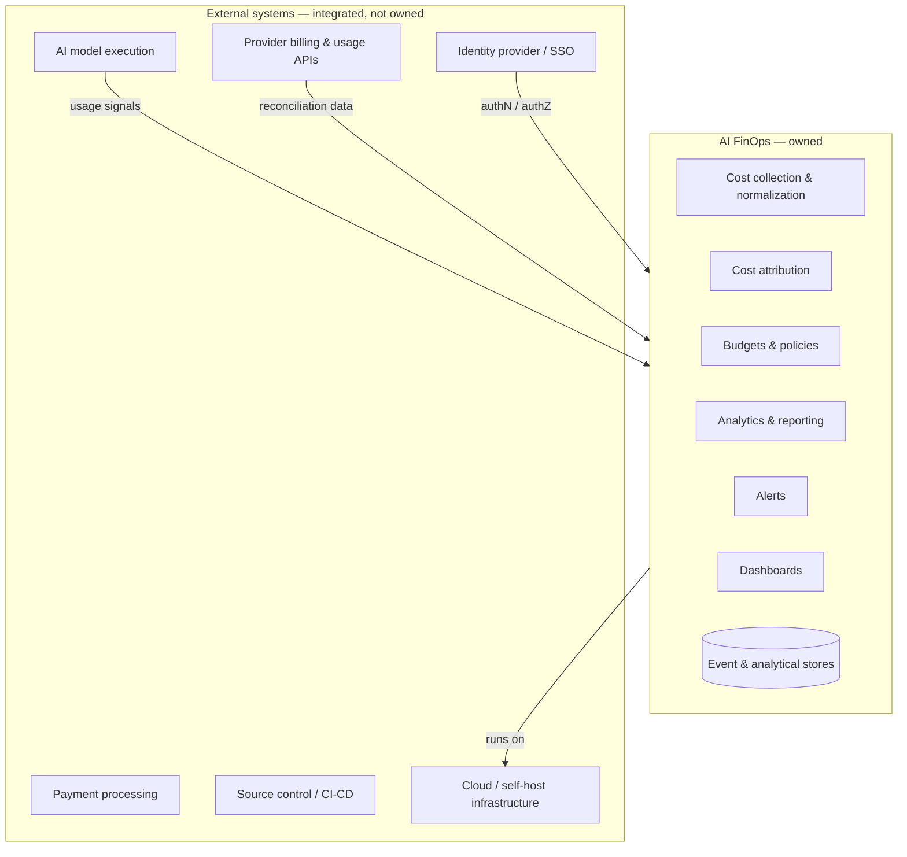

# AI FinOps — Software Design Document (SDD)
## Chapter 2: Product Goals, Non-Goals, Scope & Design Principles

| Field | Value |
|---|---|
| **Document title** | AI FinOps — Software Design Document |
| **Chapter** | 2 — Product Goals, Non-Goals, Scope & Design Principles |
| **Version** | 0.1 (Draft) |
| **Status** | Draft for Review |
| **Author** | Khan — Founder |
| **Last updated** | June 26, 2026 |
| **Classification** | Confidential — Internal |
| **Depends on** | Chapter 1 — Executive Summary |
| **Feeds** | Chapter 3 — System Context & Architecture |

> **Purpose of this chapter.** Chapter 1 established *why* AI FinOps should exist. This chapter defines *what we are building and what we are deliberately not building*, the scope of Version 1, and the product and engineering principles that constrain every future decision. The principles in §2.4–§2.5 and the boundaries in §2.6 are binding inputs to the architecture in Chapter 3. Nothing in Chapter 1 is restated here; where topics are adjacent (e.g., strategic metrics in §1.7 vs. V1 acceptance criteria in §2.9), this chapter references rather than repeats.

---

## 2.0 Strategic Framing

**Vision** is defined in §1.4 and is not repeated. Two framing statements complete it:

**Mission.** AI FinOps builds the accurate, provider-agnostic *system of record for AI spend* — software that converts fragmented, non-deterministic AI cost into governed, attributable, and optimizable spend, and that organizations can run as managed SaaS or self-hosted.

**Product philosophy.** The philosophy is not a slogan; it is encoded as enforceable principles in §2.4 (Product Principles) and §2.5 (Architecture Principles). Every feature, PR, and design review is measured against them.

**Long-term strategy (strategic arc).** The company is sequenced as a series of defensible expansions, each unlocked by the previous:

| Phase | Strategic objective | Unlock |
|---|---|---|
| **1 — Accuracy wedge** | Reconciled, attributed cost for the highest-spend API providers (OpenAI, Anthropic). Win on trust, not breadth. | A foundation finance teams believe. |
| **2 — System of record** | Cross-modality coverage: more APIs, hyperscaler AI services, and per-seat tooling (Cursor, Claude Code) unified in one cost model. | Becomes the place AI spend is reconciled. |
| **3 — Governance & optimization** | Budgets, policy, chargeback, anomaly detection, and quantified optimization recommendations. | Spend is not just seen but controlled and reduced. |
| **4 — Category standard** | FOCUS-aligned interchange, cross-customer benchmarking, agent-level economics. | Network-effect data moat and ecosystem position. |

The remainder of this chapter is scoped to **Phase 1** while ensuring nothing in Phase 1 forecloses Phases 2–4.

---

## 2.1 Product Goals

Goals are grouped into four lenses. Each goal states why it matters, how success is measured, and a priority of **Critical**, **High**, or **Medium**. Priority reflects sequencing for Version 1, not long-term importance.

### 2.1.1 Business Goals

| ID | Goal | Why it matters | Success measure | Priority |
|---|---|---|---|---|
| **B1** | Establish AI FinOps as the default system of record for AI spend in the beachhead segment. | This is the durable, finance-owned position the company is built to occupy (§1.3). | Design partners → paying logos; annualized spend under governance. | Critical |
| **B2** | Validate willingness-to-pay and a repeatable pricing model. | Determines whether the wedge is a business, not a feature. | Trial→paid conversion, ACV, gross margin, NRR. | Critical |
| **B3** | Build a proprietary data asset (cross-customer model price/performance benchmarks). | Long-term moat that adjacent incumbents cannot easily replicate (§1.6). | Benchmark coverage and accuracy; usage of benchmark-driven features. | Medium |

### 2.1.2 Customer Goals

| ID | Goal | Why it matters | Success measure | Priority |
|---|---|---|---|---|
| **C1** | Give finance a single, reconciled view of all AI spend. | Visibility is the #1 reported AI-cost problem (§1.1). | % of spend captured and reconciled to provider billing. | Critical |
| **C2** | Attribute spend to team, project, and feature. | Without attribution, organizations cannot prioritize or charge back (§1.3). | % of spend attributable to a cost owner. | Critical |
| **C3** | Prevent surprise overruns through budgets and alerts. | Eliminates the "invoice arrived and nobody was ready" failure mode. | Alert precision/recall; overruns detected before invoice. | High |
| **C4** | Reduce time-to-insight on cost anomalies. | Root-causing a spike routinely costs days (§1.1). | Median time-to-root-cause for an anomaly. | High |

### 2.1.3 Engineering Goals

| ID | Goal | Why it matters | Success measure | Priority |
|---|---|---|---|---|
| **E1** | Provider-adapter framework that adds a provider without modifying the analytics engine. | Provider count is the core scaling axis; coupling here would cap growth. | A new provider ships with zero changes to ingestion/analytics core (fitness test, §2.9). | Critical |
| **E2** | Accurate, idempotent, replayable ingestion. | Finance-grade trust depends on correctness under retries, gaps, and backfills. | Reconciliation within ±2% where official data exists; duplicate rate ≈ 0; replay determinism. | Critical |
| **E3** | Horizontal scalability to high event volume. | Token-level events grow super-linearly with adoption (§1.1). | Sustained ingest throughput; p95 query latency at target event volume. | High |
| **E4** | Self-host parity with managed SaaS. | Data-sensitive buyers will not send prompt/cost data to a third party (§1.4). | Feature-parity %; install-to-first-dashboard time on customer infra. | High |

### 2.1.4 Product Goals

| ID | Goal | Why it matters | Success measure | Priority |
|---|---|---|---|---|
| **P1** | Trustworthy numbers, transparently sourced. | A finance buyer will not act on figures that don't reconcile; estimates must be labeled, not disguised. | Reconciliation accuracy; % of estimated values explicitly labeled with confidence. | Critical |
| **P2** | Fast onboarding to first reconciled dashboard. | Time-to-value drives activation and conversion. | % of orgs reaching first reconciled dashboard within the onboarding SLA (§2.9). | High |
| **P3** | Finance-grade, exportable, auditable reporting. | The output must survive a finance review and an audit, not just look good on screen. | Report adoption; completeness of audit trail. | High |

---

## 2.2 Non-Goals

Defining non-goals is a scoping instrument: it protects focus, avoids commoditized adjacent markets (§1.2), and—critically—keeps the product on defensible, trustworthy data sources. AI FinOps is a **measurement and governance layer**, never part of the AI execution path.

| Non-Goal | Why it is out of scope |
|---|---|
| **Not an LLM gateway** | Gateways (Portkey, LiteLLM, Cloudflare AI Gateway) sit *inline* in the request path, adding latency and a single point of failure. AI FinOps integrates with gateways as a *source*; it does not route traffic. Being in the critical path would contradict E2/E4 and the boundary in §2.6. |
| **Not an AI model provider** | We measure and govern spend; we do not produce inference. Competing with the providers we observe would destroy the neutral, provider-agnostic position (§2.4, *Provider agnostic*). |
| **Not an AI coding assistant** | Out of domain. Cursor / Claude Code are *subjects* of measurement (a future cost source), not products we replicate. |
| **Not a prompt management tool** | Prompt versioning/registries (Langfuse, PromptLayer) serve the *engineering* author of prompts, a different buyer and job-to-be-done than the *finance/platform* owner of spend. |
| **Not an observability replacement** | Tracing, eval, and debugging (Datadog LLM, Langfuse) answer "is the output good / why did it fail." We answer "what does it cost and who owns it." We complement, and can ingest from, these systems—not replace them. |
| **Not a cloud cost management platform** | Cloudability / CloudHealth own infrastructure cost (compute, storage, k8s). AI FinOps focuses on token, API, and AI-subscription spend the cloud-FinOps category does not model. We may interoperate via the FOCUS standard rather than compete head-on. |
| **Not a browser-scraping product** | DOM scraping is inaccurate, breaks on UI changes, and frequently violates provider Terms of Service. It is structurally incompatible with finance-grade trust (P1) and disqualifies the product for the enterprise buyer. |
| **Not dependent on unofficial APIs** | Reliance on undocumented endpoints is brittle and legally exposed. Data sources must be official provider APIs, sanctioned billing/usage endpoints, gateway logs, or customer-authorized SDK signals. Trust is the product. |

---

## 2.3 MVP Scope (Version 1)

Version 1 must be deliverable by a small team and must prove the **accuracy wedge** (Phase 1). Scope discipline is treated as a feature: every item not in "Included" is a deliberate deferral, not an omission.

### 2.3.1 Included in V1

- **Provider coverage:** OpenAI API, Anthropic API.
- **Provider adapter framework:** the extensibility contract that makes provider count additive (E1).
- **Organization management:** tenant boundary, settings, provider credential storage.
- **Projects:** the primary unit of cost attribution.
- **Users & access:** basic authentication and role-based access (lightweight RBAC; *not* enterprise SSO).
- **Budgets:** per-organization and per-project budget definitions with thresholds.
- **Cost attribution:** mapping normalized usage/cost events to projects (and to tags/metadata where available).
- **Dashboard:** real-time and historical spend, by provider, model, and project.
- **Alerts:** budget-threshold and anomaly-style alerts via at least one channel (e.g., email/webhook).
- **Reporting:** exportable, reconciled spend and attribution reports.

### 2.3.2 Not Included in V1 (Deferred)

| Deferred item | Why deferred |
|---|---|
| **Browser extension** | Depends on estimation/scraping for consumer surfaces—conflicts with the accuracy-first mandate (P1) and the non-goal on scraping. Adds a distribution and maintenance surface unrelated to the wedge. |
| **Desktop application** | A delivery channel, not a capability. The web dashboard + API satisfy V1; a desktop app multiplies platform maintenance without expanding the core value. |
| **IDE plugins** | Serve the individual developer, not the finance/platform buyer (§1.5). Additive once the system-of-record exists; premature before it does. |
| **AI optimization engine** | Optimization recommendations are only credible *on top of* accurate, attributed data. Building recommendations before the data foundation is trustworthy would surface unreliable advice. Phase 3. |
| **Multi-cloud integrations (Bedrock, Azure OpenAI, Vertex)** | Each hyperscaler AI surface is a distinct, billing-complex adapter. Valuable, but the adapter framework must first be proven on the two highest-spend direct APIs. Phase 2. |
| **Enterprise SSO (SAML/SCIM)** | An enterprise-procurement requirement, not a wedge requirement. Beachhead customers (§1.5) onboard without it; building it early spends effort ahead of the segment that needs it. |
| **Billing engine** | AI FinOps *reports and attributes* spend; it does not invoice. Building a billing system conflates the product with the providers' billing and adds heavy compliance scope (§2.6). |
| **Recommendation engine** | Same dependency as the optimization engine: requires a mature, accurate data and benchmarking layer first. Phase 3. |

### 2.3.3 Future (Post-V1 Roadmap, Non-Binding)

Additional providers (Gemini, xAI) and per-seat cost sources (Cursor, Claude Code, Copilot); hyperscaler AI services; anomaly detection and forecasting models; optimization and recommendation engines; chargeback/showback; enterprise SSO and advanced RBAC; self-host GA; FOCUS-aligned import/export; cross-customer benchmarking; and agent-level cost attribution.

---

## 2.4 Product Principles

These principles govern *what* the product does and how it behaves. Every future feature must demonstrate conformance. Each principle gives its meaning, why it exists, and its engineering implications.

**PP-1 — Accuracy before intelligence.**
*Meaning:* Correct, reconciled numbers take priority over forecasts, recommendations, or "smart" features. *Why:* A finance buyer acts on trust; one confidently wrong figure costs more credibility than ten missing features. *Implications:* Reconciliation tests gate releases; estimated values are labeled with confidence; intelligence features ship only on data that reconciles.

**PP-2 — SDK-first architecture.**
*Meaning:* The primary integration is a lightweight SDK/callback or sanctioned API read, not an inline proxy. *Why:* Avoids becoming a latency tax or single point of failure in the customer's AI path (contrast §2.2, gateways). *Implications:* Asynchronous, out-of-band ingestion is the default path; any optional proxy mode is strictly opt-in and isolated.

**PP-3 — Provider agnostic.**
*Meaning:* No provider is privileged in the data model or UI; all are normalized to a common schema. *Why:* The product's value *is* the cross-provider view; neutrality is also commercially necessary (§2.2). *Implications:* A canonical cost/usage model; provider specifics live only inside adapters (§2.5, AP-4).

**PP-4 — Self-hosted friendly.**
*Meaning:* The product can run entirely on customer-controlled infrastructure with no hard external dependencies. *Why:* Data-sensitive and regulated buyers will not export prompt/cost data (§1.4). *Implications:* No reliance on proprietary managed-only services in the core path; configuration over hard-coding; reproducible deployment.

**PP-5 — Privacy first.**
*Meaning:* Collect the minimum needed for cost governance; prompt/response *content* is not required and is not stored by default. *Why:* Reduces breach blast radius and removes a primary objection from security review. *Implications:* Metadata-and-cost by default; content capture (if ever) is explicit, scoped, and opt-in; encryption of secrets at rest.

**PP-6 — Finance-grade reporting.**
*Meaning:* Outputs must survive a finance review and an audit—reconciled, exportable, and traceable to source. *Why:* The buyer's deliverable is a defensible number, not a chart (P3). *Implications:* Every reported figure is traceable to immutable source events; exports are deterministic; an audit trail is first-class.

**PP-7 — Extensible plugin architecture.**
*Meaning:* New providers, alert channels, and export targets are added as plugins against stable contracts. *Why:* Growth is bounded by how cheaply the surface area expands (E1). *Implications:* Versioned interfaces; capability discovery; additions require no core changes (§2.9 fitness test).

**PP-8 — Developer experience matters.**
*Meaning:* Integration is measured in minutes; the API and SDK are clear and well-documented. *Why:* Time-to-value drives activation and conversion (P2). *Implications:* Sensible defaults, first-class API docs, minimal required configuration to first reconciled dashboard.

**PP-9 — Simple over complex.**
*Meaning:* Prefer the simplest design that satisfies the requirement; complexity must be justified. *Why:* A small team's primary risk is over-engineering ahead of demand. *Implications:* No speculative abstractions; defer ML/optimization until the data justifies it; YAGNI as a review criterion.

**PP-10 — Secure by default.**
*Meaning:* The safe configuration is the default; secure choices require no extra steps. *Why:* Credentials to multiple AI providers make this a high-value target. *Implications:* Encrypted secret storage, least-privilege access, no secrets in logs, secure defaults for every new surface.

---

## 2.5 Architecture Principles

These are binding engineering rules. They are the constraints Chapter 3 must satisfy. Each gives its purpose, an example, the reasoning (including *why this over the alternative*), and trade-offs.

### Reference architecture (illustrating AP-1 through AP-6)

**AP-1 — Everything is an event; processing is event-driven.**
*Purpose:* Model every usage/cost observation as an immutable fact, processed asynchronously. *Example:* "Anthropic API call: N input tokens, M output tokens, model X, at time T" is an event, not a row mutated in place. *Reasoning:* Event-driven ingestion decouples collection from analysis, absorbs provider latency/bursts, and enables replay—*chosen over* synchronous CRUD writes, which couple ingestion to query load and lose history. *Trade-offs:* Eventual consistency between ingestion and read models; requires a streaming/queue substrate.

**AP-2 — Immutable, append-only event store.**
*Purpose:* Raw events are never updated or deleted; corrections are new events. *Example:* A late provider reconciliation is appended as an adjusting event, not an overwrite. *Reasoning:* Auditability and historical analytics (PP-6) require the source of truth to be permanent—*chosen over* mutable storage, which cannot reconstruct past state. *Trade-offs:* Storage grows monotonically (mitigated by tiering/retention on derived data); read models must be computed.

**AP-3 — Idempotent event ingestion.**
*Purpose:* Re-delivering the same event produces no duplicate effect. *Example:* A provider page retried after a timeout is de-duplicated by a deterministic event key. *Reasoning:* At-least-once delivery and retries are unavoidable; idempotency is the only way to guarantee reconciliation under failure (E2)—*chosen over* best-effort dedup, which silently corrupts totals. *Trade-offs:* Requires stable natural keys and dedup bookkeeping.

**AP-4 — Providers are plugins, isolated behind adapters.**
*Purpose:* All provider-specific logic (auth, fetch, schema, pricing quirks) lives inside an adapter implementing a stable contract; nothing else knows a provider exists. *Example:* Adding xAI means writing one adapter; ingestion, storage, and analytics are untouched. *Reasoning:* Provider count is the core scaling axis (E1)—*chosen over* direct integration in shared services, which would couple every new provider to the core. *Trade-offs:* The adapter contract must be carefully versioned; leaky provider semantics are a constant design pressure.

**AP-5 — Analytics never modify raw events (CQRS-style separation).**
*Purpose:* Analytical and read paths consume events and build derived read models; they never write back to the event store. *Example:* The dashboard reads a precomputed cost aggregate; recomputation re-derives it from events. *Reasoning:* Separating writes (events) from reads (projections) lets each scale and evolve independently—*chosen over* a single read-write model, which couples query performance to ingestion and risks corrupting source data. *Trade-offs:* Read models can lag; multiple representations to maintain.

**AP-6 — Polyglot persistence: relational for metadata, analytical store for events.**
*Purpose:* Organizations, projects, users, budgets, and policy live in a relational store; high-volume usage/cost events live in an analytical/time-series store. *Example:* "Which projects exist and their budgets" is relational; "spend per model per hour over 90 days" is analytical. *Reasoning:* These workloads have opposite shapes—relational integrity vs. append-heavy time-series scans—and forcing both into one engine sacrifices one (a known scaling ceiling for single-Postgres designs)—*chosen over* a single database for operational simplicity, a trade made consciously. *Trade-offs:* Two stores to operate, secure, and keep consistent.

**AP-7 — Every component is horizontally scalable (stateless services).**
*Purpose:* Services hold no local state; capacity is added by adding instances. *Example:* Ingestion workers scale out with event volume; state lives in the stores/queue. *Reasoning:* Token-level volume grows super-linearly (E3); vertical scaling has a hard ceiling—*chosen over* stateful nodes, which cap throughput and complicate failover. *Trade-offs:* Externalized state and coordination overhead.

**AP-8 — No vendor lock-in.**
*Purpose:* Core depends on open standards and swappable infrastructure, not a single managed provider. *Example:* The analytical store and queue are abstracted behind interfaces; cost/usage interchange targets the FOCUS standard. *Reasoning:* Required for self-hosting (PP-4) and for portability across customer environments—*chosen over* deep coupling to one cloud's managed services, which would block the self-host segment. *Trade-offs:* Some loss of managed-service convenience; abstraction cost.

**AP-9 — API-first design.**
*Purpose:* Every capability is exposed through a documented API; the UI is one consumer among many. *Example:* The dashboard, exports, and customer automations all call the same API. *Reasoning:* Enables integration, automation, and the future plugin/ecosystem strategy (Phase 4)—*chosen over* a UI-coupled backend, which cannot be automated against. *Trade-offs:* API design and versioning discipline required from day one.

**AP-10 — Background jobs for long-running work.**
*Purpose:* Polling, backfills, report generation, and reconciliation run asynchronously, never in a request thread. *Example:* A 90-day historical backfill runs as a job with progress, not a blocking call. *Reasoning:* Provider reads are slow and rate-limited; request-path execution would break SLAs—*chosen over* synchronous execution, which couples user latency to provider latency. *Trade-offs:* Job orchestration, scheduling, and observability are needed.

**AP-11 — Design for failure.**
*Purpose:* Assume providers, queues, and stores will fail; degrade gracefully and recover automatically. *Example:* Provider outages trigger backoff and retry with a dead-letter path; the dashboard serves last-reconciled data with a freshness indicator. *Reasoning:* The system depends on many external surfaces with independent failure modes—*chosen over* assuming reliability, which guarantees outages become data-correctness incidents. *Trade-offs:* Retry, backpressure, DLQ, and circuit-breaking add complexity that must itself be tested.

---

## 2.6 Product Boundaries

AI FinOps owns measurement, attribution, governance, and reporting. It *integrates with* but never *replaces* the systems that execute AI, authenticate users, process payments, or store code. The defining boundary: **AI FinOps sits alongside the AI execution path, never inside it.**

| AI FinOps owns | External systems own | Boundary rationale |
|---|---|---|
| AI cost collection (via official adapters) | AI model execution (providers run inference) | We observe spend; we never run or route the workload (reinforces §2.2 gateway non-goal). |
| Normalization & cost attribution | Provider billing & usage APIs (source of truth) | We reconcile *against* provider billing; we are not the billing authority. |
| Budgets, policies, alerts | Identity providers / SSO | We consume identity (OIDC/SAML later); we do not build an IdP. |
| Analytics, dashboards, reports | Payment processing | Our own subscription billing uses an external processor; it is out of *product* scope (§2.3). |
| The event & analytical stores | Source control / CI-CD | Out of domain; may be ingested as attribution metadata in a later phase, never owned. |
| Deployment configuration | Cloud / self-host infrastructure | We run on the customer's chosen substrate (PP-4); we do not own the infrastructure layer. |

---

## 2.7 Assumptions

Assumptions are recorded so they can be tested and invalidated. Each lists its design implication and a confidence level; low-confidence assumptions are explicit risks (§2.8).

| ID | Assumption | Design implication | Confidence |
|---|---|---|---|
| **A1** | Organizations use multiple AI providers simultaneously. | Cross-provider normalization is the core, not an add-on (PP-3). | High |
| **A2** | Providers expose machine-readable usage in API responses and/or billing endpoints. | Adapters can collect accurate usage without scraping (§2.2). | High |
| **A3** | Some surfaces expose only partial or no usage (e.g., consumer subscriptions). | Estimation is sometimes required and **must be labeled** with confidence (PP-1). | High |
| **A4** | A material segment of customers requires self-hosting. | No managed-only hard dependencies in the core path (PP-4, AP-8). | Medium-High |
| **A5** | Provider pricing changes over time and varies by model/tier. | Cost = f(usage, *price-at-event-time*); pricing is a versioned, dated catalog, never hard-coded. | High |
| **A6** | Customers want historical analytics and trend reconstruction. | Immutable event retention and time-travel queries (AP-2). | High |
| **A7** | Usage (event) volume will grow significantly with adoption. | Analytical store and stateless services sized for super-linear growth (AP-6, AP-7). | High |
| **A8** | Provider usage/billing reads are rate-limited and may lag real time. | Respectful polling with backoff; provisional vs. reconciled states surfaced (AP-10, AP-11). | High |
| **A9** | Customers will integrate via SDK/callback or sanctioned API reads, not an inline proxy. | SDK-first ingestion is the default path (PP-2). | Medium |

---

## 2.8 Risks

Risks are rated by likelihood and impact (Low / Medium / High) with a mitigation strategy. These feed the architecture and operational planning in later chapters.

| Risk | Likelihood | Impact | Mitigation |
|---|---|---|---|
| **Provider API changes** (schema, auth, endpoints) | High | Medium | Adapter isolation (AP-4) contains blast radius to one plugin; contract tests per adapter; versioned adapters; monitoring of upstream changes. |
| **Pricing changes** | High | Medium | Dated, versioned pricing catalog (A5); cost computed at event time; pricing updates are data, not code deploys. |
| **Data accuracy / reconciliation drift** | Medium | High | Reconciliation against provider billing (E2); ±2% accuracy gate (§2.9); explicit confidence labeling for estimates (PP-1). |
| **Large event volumes** | Medium | High | Append-only analytical store, stateless horizontal scaling, async ingestion (AP-6/7/1); load testing to target volume. |
| **Enterprise adoption friction** (SSO, procurement, security review) | Medium | Medium | Beachhead does not require enterprise features (§1.5); self-host and privacy-first reduce security objections (PP-4/5); SSO sequenced for the enterprise phase. |
| **Security breach** (multi-provider credentials are high-value) | Low-Medium | High | Encrypted secret storage, least privilege, no content capture by default, no secrets in logs (PP-5/10); secure-by-default surfaces. |
| **Compliance scope creep** (storing regulated data) | Medium | Medium | Privacy-first minimization (PP-5) keeps regulated-data exposure low; self-host keeps data in customer boundary; billing-engine non-goal avoids PCI scope (§2.3). |
| **Vendor / infrastructure lock-in** | Medium | Medium | Open standards (FOCUS), abstracted infrastructure, no managed-only core dependency (AP-8). |
| **Rate limiting on provider reads** | High | Medium | Backoff, caching, scheduled background jobs (AP-10); provisional-then-reconciled UX (A8). |
| **Incumbent entry** (cloud-FinOps or APM vendors add AI cost) | Medium | High | Win the wedge on depth and accuracy before incumbents generalize; cross-modality coverage and self-host as differentiators; benchmarking data moat (B3). |
| **Provider/competitor consolidation** (e.g., observability acquisitions) | Medium | Low-Medium | Neutral, provider-agnostic position; integrate-don't-depend posture toward any single vendor. |

---

## 2.9 Success Criteria (Version 1 Acceptance)

These are concrete, testable acceptance gates for shipping V1. They are distinct from the strategic metrics in §1.7: §1.7 measures business outcomes over time; §2.9 defines the *definition of done* for the first release. Targets are draft and will be confirmed with design partners.

| ID | Acceptance criterion | Target / definition of done | How verified |
|---|---|---|---|
| **SC-1** | An organization can onboard to a first reconciled dashboard quickly. | ≤ 15 minutes from signup to first reconciled spend view. | Timed onboarding runs across design partners. |
| **SC-2** | The dashboard is responsive at expected V1 data volume. | p95 page/query load < 2 seconds. | Load test at target event volume; latency monitoring. |
| **SC-3** | Reported spend reconciles to provider billing where official data exists. | Within **±2%** of provider-reported figures. | Automated reconciliation tests against provider billing data. |
| **SC-4** | Budgets and alerts behave correctly. | No missed threshold breaches; alert precision/recall meet defined bounds; alerts deliver on at least one channel. | Synthetic budget/alert test suite. |
| **SC-5** | The adapter framework is genuinely decoupled (architectural fitness). | A new provider is added with **zero changes** to the ingestion, event store, or analytics core. | Add a reference provider via adapter only; diff confirms no core changes (E1, AP-4). |
| **SC-6** | Ingestion is idempotent and replayable. | Replaying the event log reproduces identical read-model state; duplicate delivery causes no double-counting. | Replay and duplicate-injection tests (E2, AP-2/3). |
| **SC-7** | Data freshness is bounded and visible. | Spend reflects new usage within the defined freshness SLA; provisional vs. reconciled state is shown. | Freshness monitoring; UX review (A8, AP-11). |
| **SC-8** | Access control and tenancy are enforced. | Users see only their organization's data; roles gate sensitive actions. | Authorization test suite; tenancy isolation tests. |
| **SC-9** | Reports are accurate and exportable. | Exports are deterministic and traceable to source events. | Export verification against reconciled totals (PP-6). |
| **SC-10** | Estimated values are never presented as exact. | Every estimated figure carries an explicit confidence/label. | UI/report audit (PP-1). |

---

_End of Chapter 2. The principles (§2.4–§2.5), boundaries (§2.6), and assumptions (§2.7) defined here are binding constraints on **Chapter 3 — System Context & High-Level Architecture**, which translates them into concrete components, data flows, and technology choices._
