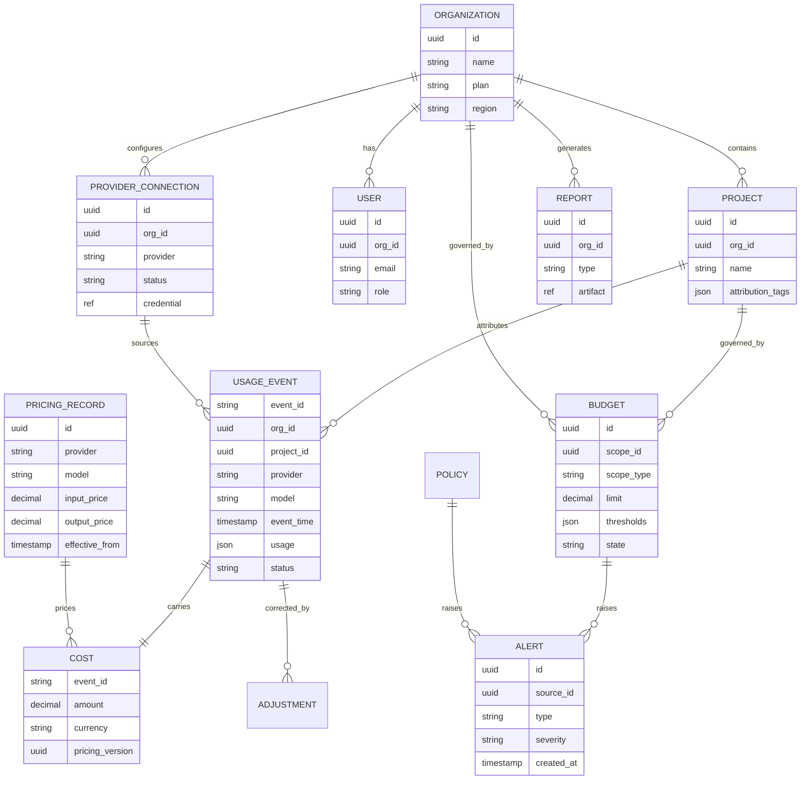
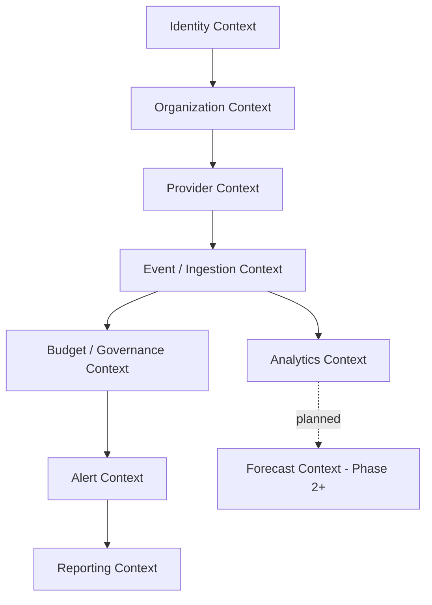
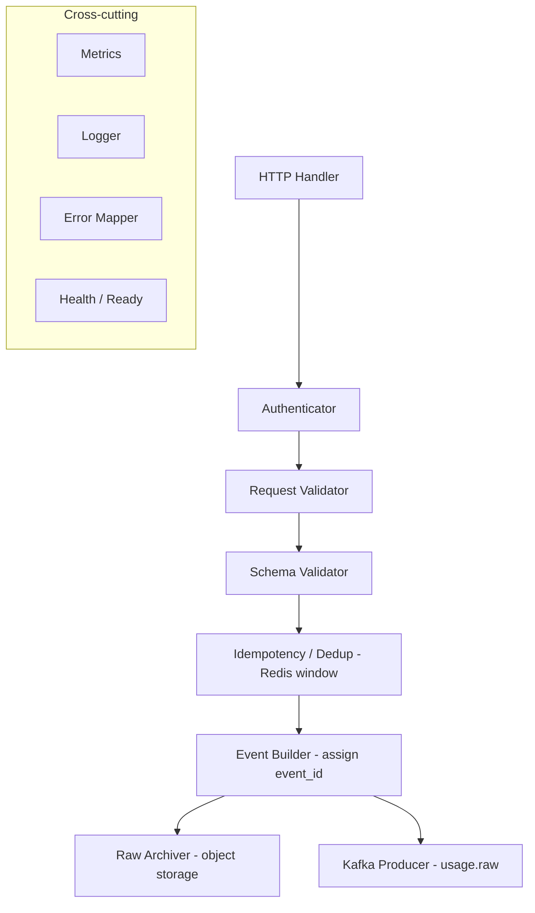
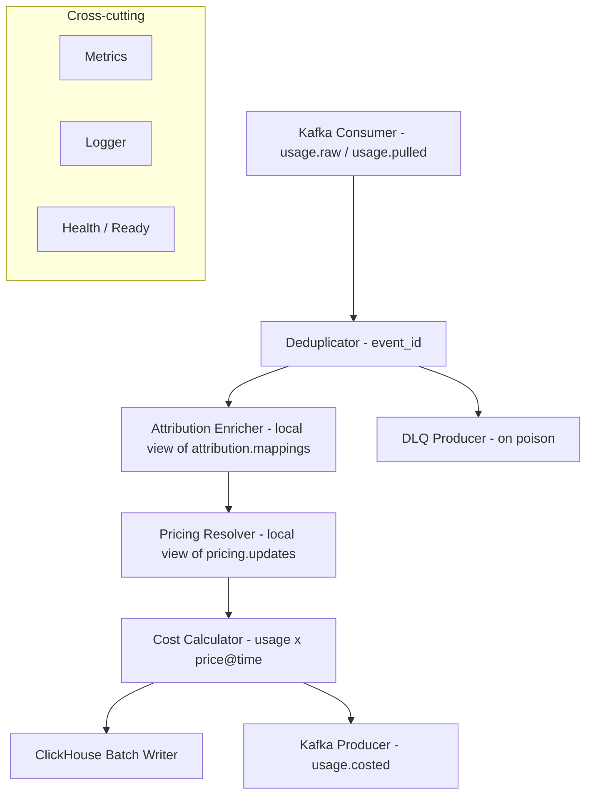
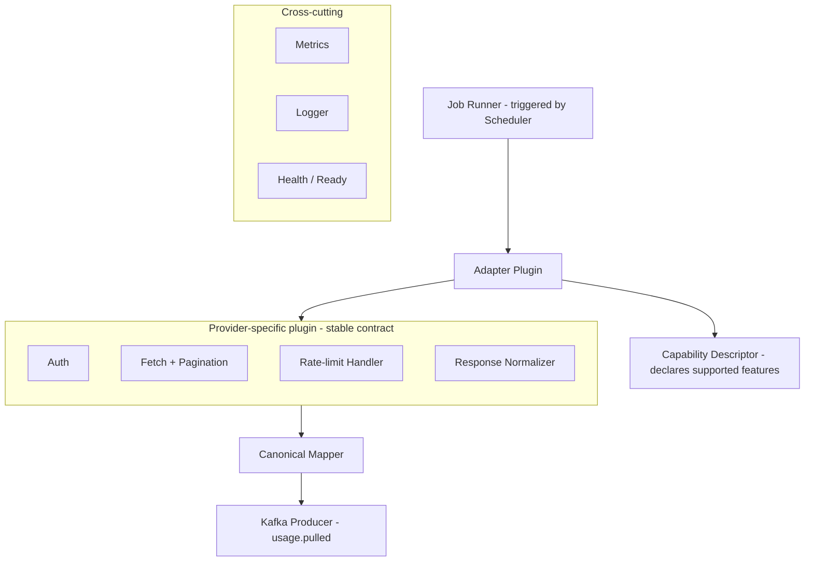
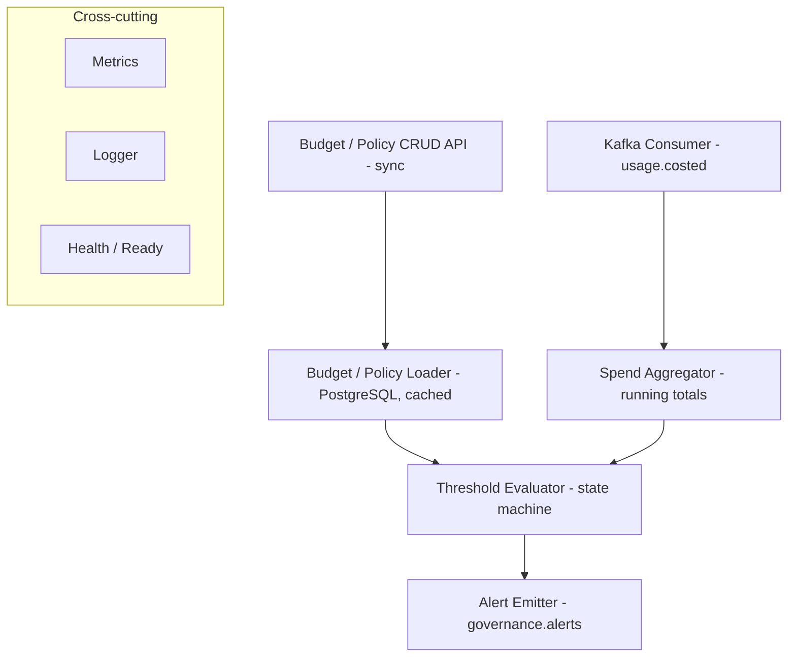
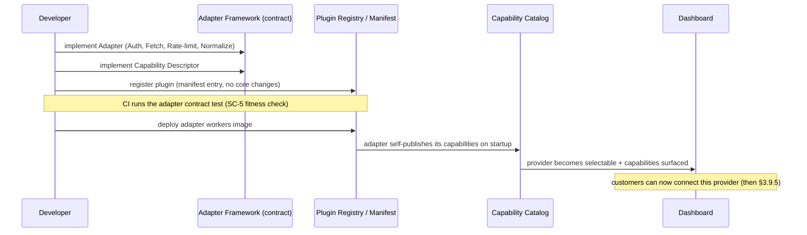
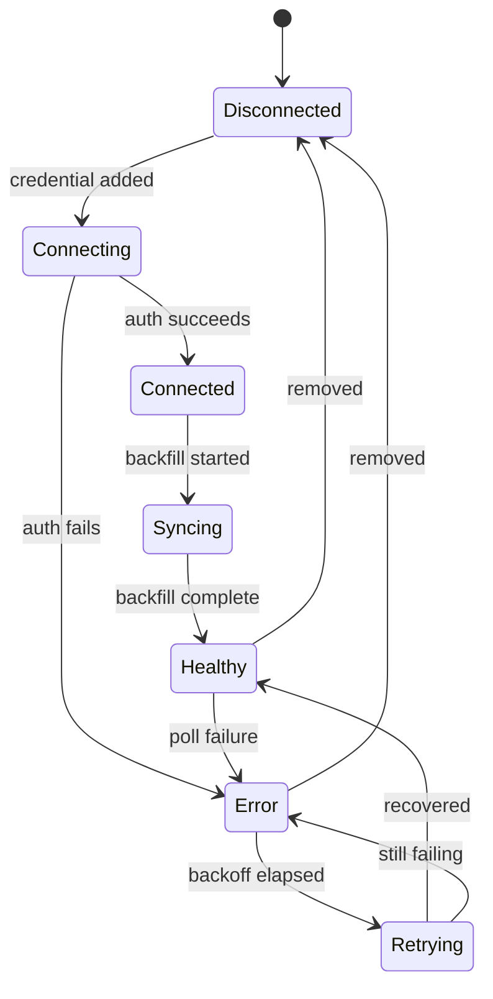
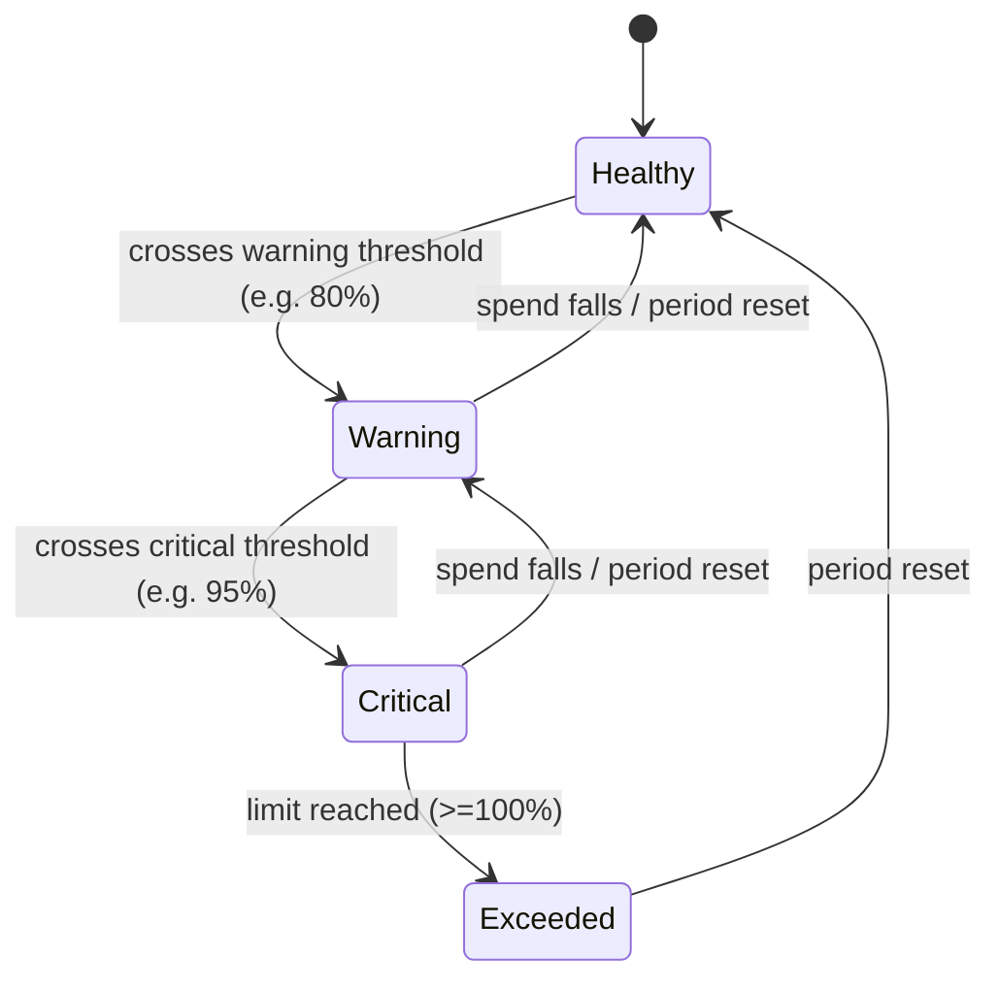
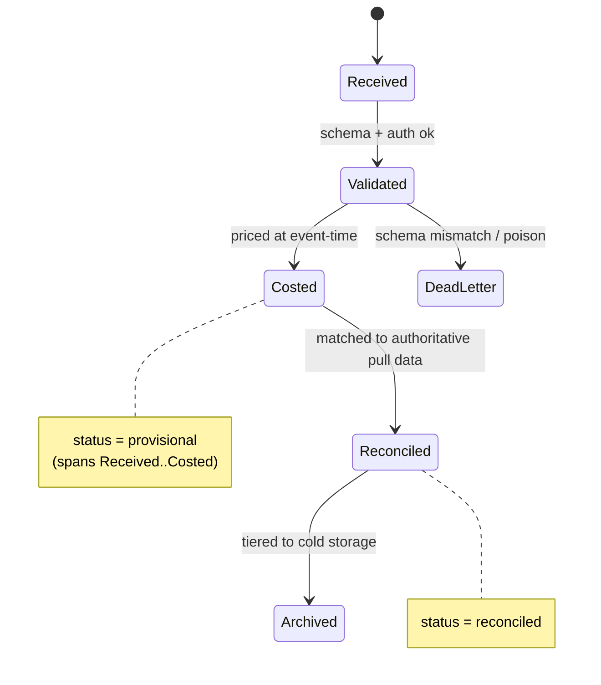

# AI FinOps — Software Design Document (SDD)
## Chapter 3 (Part 2): Domain Model, Components & Engineering Contracts

| Field | Value |
|---|---|
| **Document title** | AI FinOps — Software Design Document |
| **Chapter** | 3 (Part 2) — Domain Model, Components & Engineering Contracts |
| **Version** | 0.2 (Draft — additions to Chapter 3) |
| **Status** | Draft for Review |
| **Author** | Khan — Founder |
| **Last updated** | June 26, 2026 |
| **Extends** | Chapter 3 (Part 1) §3.1–§3.14 |

> **Purpose.** Part 1 defined services, data ownership, communication, events, deployment, and request flows. Part 2 adds the layers that make the chapter genuinely implementation-ready: the **domain model and ubiquitous language**, the **bounded contexts** and what each owns, **component-level (C4 L3) internals** for the complex services, the **developer extensibility flow**, and the shared engineering contracts — **health endpoints, error taxonomy, state machines, multi-region placeholder, repository structure, and an ADR register**. Placement notes indicate where each section logically belongs in a merged Chapter 3.

---

## 3.15 Domain Model & Ubiquitous Language
*Placement: logically belongs immediately after §3.1, before the service catalog. It is the vocabulary every other section uses.*

The domain is small, which is a strength. Naming is fixed here; these terms are used identically in code, schema, APIs, and conversation.



| Term | Definition | Notes |
|---|---|---|
| **Organization** | The tenant. Top of the ownership tree; carries plan and (later) region. | Tenancy boundary for all data (§3.10.3). |
| **Project** | The primary unit of cost attribution within an organization. | An API key/tag resolves to a Project at enrichment (§3.9.1). |
| **User** | A human principal with a role inside an Organization. | RBAC subject. |
| **Provider Connection** | A configured link to an AI provider (credential + status). | Has a lifecycle state machine (§3.21). |
| **Usage Event** | The atomic immutable fact: usage of a model at a point in time. | The canonical envelope (§3.7.1). |
| **Cost** | The monetary value of a Usage Event, computed at event-time pricing. | Always traceable to a Pricing Record. |
| **Pricing Record** | A dated price for a provider/model. | Versioned data, not code (§A5). |
| **Adjustment** | A correction to a Usage Event/Cost from reconciliation. | Resolved via `ReplacingMergeTree` (§3.8.3). |
| **Budget** | A spend limit scoped to an Organization or Project, with thresholds. | Has a state machine (§3.21). |
| **Policy** | A governance rule (e.g., per-model caps, approval requirements). | Evaluated by Governance. |
| **Alert** | A raised signal from a breached Budget/Policy or anomaly. | Delivered by Notification. |
| **Report** | A generated, exportable artifact of spend/attribution. | Stored in object storage. |

---

## 3.16 Bounded Contexts
*Placement: after §3.15. This is the domain-oriented lens; §3.3–§3.4 is the deployment-oriented lens. They are reconciled in the "Realized by" column.*

Contexts are the units of *meaning and ownership*; services are the units of *deployment*. Several contexts may co-locate in one V1 service (§3.10.2) without sharing a model.



| Bounded Context | Owns (Data) | APIs | Events (pub / sub) | Core Business Rules | Realized by |
|---|---|---|---|---|---|
| **Identity** | Users, roles, API keys, credentials | AuthN/Z, key mgmt (sync) | pub `AttributionMappingChanged` | Least privilege; credential encryption; tenant isolation | Identity Service |
| **Organization** | Orgs, projects, attribution structure | Org/project CRUD (sync) | pub attribution changes | A project belongs to exactly one org; attribution must resolve | Identity Service (co-located V1) |
| **Provider** | Provider connections, adapters, pricing catalog | Connect/poll config; pricing read | pub `PricingCatalogUpdated`, `ProviderUsageFetched` | Official sources only (§2.2); pricing is dated data | Adapter Workers + Pricing Service |
| **Event / Ingestion** | Raw + costed usage events, archive | Collector ingest (async ack) | pub `UsageEventReceived`, `CostedUsageEvent`; sub raw | Idempotent; immutable; cost at event-time | Collector + Normalization |
| **Analytics** | Rollups, query read models | Spend/usage queries (sync) | sub `CostedUsageEvent` | Reads never mutate raw (§AP-5); tenant-scoped | Query Service |
| **Budget / Governance** | Budgets, policies | Budget/policy CRUD (sync) | pub `AlertRaised`; sub `CostedUsageEvent` | Evaluate before commitment; deterministic thresholds | Governance |
| **Alert** | Alert records, delivery state | — | sub `AlertRaised` | Idempotent delivery; retry/backoff | Governance (detect) + Notification (deliver) |
| **Reporting** | Report artifacts | Report request/fetch (sync + async) | pub/sub `Report*` | Deterministic, traceable exports (§PP-6) | Reporting Service |
| **Forecast** *(Phase 2+)* | Forecast models, projections | Forecast queries | sub costed/rollups | Accuracy before intelligence (§PP-1) | *Future — deferred per §2.3* |

---

## 3.17 Component Architecture (C4 Level 3)
*Placement: expands §3.4. Only the four services with non-trivial internals are drawn; all others follow the standard layering in §3.17.5.*

### 3.17.1 Collector / Ingestion API


*Responsibility split:* every step before `Kafka Producer` is fast and stateless; the producer is the only durable side effect besides the raw archive. No costing or DB writes happen here (§AP-1).

### 3.17.2 Normalization & Costing


*Critical detail:* the Attribution Enricher and Pricing Resolver read **local materialized views fed by compacted topics** (§3.4 notes), never a synchronous control-plane call.

### 3.17.3 Adapter Worker (the extensibility unit)


*The plugin boundary is the entire extensibility contract:* a new provider implements `Auth / Fetch / Rate-limit / Normalize` and a `Capability Descriptor`. Nothing outside the plugin changes (§AP-4, satisfies SC-5).

### 3.17.4 Governance (Budgets & Policies)



### 3.17.5 Standard internal layering (all other services)

Every remaining service (Public API, Query, Identity, Pricing, Reconciliation, Reporting, Notification, Scheduler) follows the same four-layer shape, so they are not drawn individually:

`Transport adapter (HTTP/gRPC/Kafka consumer)` → `Domain logic (the service's single responsibility)` → `Ports (DB / queue / cache / object-store clients)` → `Cross-cutting (health, metrics, structured logging, error mapping)`.

---

## 3.18 Extensibility: Adding a New Provider (Developer Flow)
*Placement: pairs with §3.9.5. That flow is a **customer** connecting a provider at runtime; this flow is a **developer** adding support for a provider at build time.*



This is the operational proof of PP-7 (extensible plugin architecture): provider support ships as an isolated plugin plus a manifest entry, gated by the contract test that asserts zero changes to ingestion or analytics (SC-5).

---

## 3.19 Service Health & Operational Contract
*Placement: add to §3.11 (cross-cutting).*

Every deployable service exposes the same operational endpoints. These are the contract Kubernetes and the observability stack depend on.

| Endpoint | Meaning | Used by |
|---|---|---|
| `/health` | **Liveness** — the process is up and not deadlocked. | K8s liveness probe (restart on fail) |
| `/ready` | **Readiness** — dependencies (DB, Kafka, cache) are reachable and the service can serve/consume. | K8s readiness probe (remove from rotation / pause consumption) |
| `/metrics` | Prometheus metrics (throughput, latency, consumer lag, error rates). | Monitoring + SLOs (§3.11) |
| `/version` | Build/version, commit, schema/contract versions. | Deploys, debugging, compatibility checks |

Readiness is deliberately stricter than liveness: a service whose Kafka connection drops is *live* (do not restart) but *not ready* (stop routing/consuming until recovered), which aligns with graceful degradation (§AP-11). Decision recorded as **ADR-016**.

---

## 3.20 Error Taxonomy & Common Error Model
*Placement: add to §3.6 (communication) and §3.11.*

All services emit errors in one envelope so callers and consumers handle failures uniformly. Decision recorded as **ADR-015**.

**Common error envelope (conceptual):** `{ code, message, retryable (bool), details, correlation_id }`.

| Error code | Meaning | Retryable | Typical source | Handling |
|---|---|---|---|---|
| `ValidationError` | Malformed request/payload | No | Collector, Public API | Reject `4xx`; do not enqueue |
| `AuthenticationError` | Bad/expired credential or token | No | Edge, Collector, Adapters | Reject; surface re-auth |
| `SchemaMismatch` | Event/contract version mismatch | No | Collector, Normalization | Route to DLQ; alert operators |
| `DuplicateEvent` | Idempotency key already seen | No (benign) | Collector, Normalization | Drop silently; count metric (§3.8.4) |
| `PricingUnavailable` | No pricing record for model/time | Yes | Normalization | Park event; retry after pricing update (`pricing.updates`) |
| `ProviderUnavailable` | Upstream provider error/outage | Yes | Adapter Workers | Backoff + retry; circuit-break (§AP-11) |
| `RateLimited` | Provider or internal rate limit hit | Yes | Adapters, Edge | Respect backoff window; reschedule poll |
| `InternalError` | Unexpected failure | Maybe | Any | Log + correlation_id; alert if rate exceeds SLO |

The `retryable` flag drives behavior automatically: retryable errors re-enter the pipeline with backoff; non-retryable poison messages go to `dlq.*`. This is what makes failure handling (§3.6, §3.11) consistent rather than per-service.

---

## 3.21 State Machines
*Placement: add to §3.4 (Provider Connection → Adapter/Identity), §3.7 (Event lifecycle), and §3.4 Governance (Budget).*

### 3.21.1 Provider Connection



### 3.21.2 Budget


*Each upward transition emits an `AlertRaised` (§3.9.4). The `state` field on Budget (§3.15) is this machine's current value.*

### 3.21.3 Usage Event lifecycle


*This refines — and is consistent with — the `status` field defined in §3.7.1: `provisional` covers Received→Costed; `reconciled` is the Reconciled state; Archived is the terminal storage tier.*

---

## 3.22 Multi-Region & Disaster Recovery (Post-MVP Placeholder)
*Placement: new forward-looking section. Explicitly **not** an MVP requirement; recorded as **ADR-018**. Included so the MVP makes no choice that blocks it.*

The MVP runs single-region. The architecture already supports the foundations of multi-region and DR because the event log plus the immutable object-storage archive (§3.8.1) make state **replayable**. Open questions to resolve when the enterprise/EU segment requires it:

| Concern | Direction (to be ratified by ADR later) |
|---|---|
| **Data residency** (US / EU / Asia) | Pin an Organization to a home region (the `region` field, §3.15); route and store its data there for GDPR-style residency. |
| **ClickHouse** | Supports replication; cross-region is async (replicate or re-derive from archive), not synchronous. |
| **Kafka / Redpanda** | Avoid synchronous cross-region; use cluster linking / mirroring for DR, keep processing region-local. |
| **PostgreSQL** | Regional primary + cross-region read replica for DR. |
| **Object storage** | Regional buckets with cross-region replication for the archive. |
| **Disaster recovery** | Define RPO/RTO; primary recovery path is **replay from the object-storage archive** to rebuild read models. |

The single MVP constraint this imposes today: keep `org_id` and `region` first-class on every record so future regional pinning needs no migration.

---

## 3.23 Repository Structure
*Placement: new conventions section. Recorded as **ADR-017**. A **monorepo** is chosen to keep the polyglot services (§3.12), shared contracts, and SDKs versioned together.*

```text
ai-finops/
├── docs/                  # SDD chapters, ADRs (docs/adr/), runbooks
├── backend/
│   ├── services/          # one dir per deployable unit (api, ingest, workers, jobs)
│   └── adapters/          # provider plugins (openai, anthropic, ...)
├── frontend/              # dashboard application
├── sdk/                   # client SDKs (per language)
├── packages/              # SHARED CONTRACTS — single source of truth
│   ├── event-schema/      #   canonical event envelope (§3.7.1)
│   ├── proto/             #   gRPC service definitions (§3.6)
│   └── errors/            #   common error model (§3.20)
├── deployment/            # Docker, Helm charts, K8s manifests, Terraform
├── scripts/               # dev + ops automation
├── tests/                 # cross-service / integration / contract tests (incl. SC-5 fitness test)
└── examples/              # adapter examples, SDK usage samples
```

The `packages/` directory is load-bearing: the **event schema, proto contracts, and error model live in exactly one place** and are consumed by every service and SDK, which is what keeps the contracts in §3.7, §3.6, and §3.20 from drifting between services.

---

## 3.24 Architecture Decision Records (ADR Register)
*Placement: new section. Every significant decision in Chapter 3 gets an ADR so it is not silently re-litigated. Convention: `docs/adr/ADR-XXX-title.md`, status one of Proposed / Accepted / Superseded.*

| ADR | Decision | Status | Source section |
|---|---|---|---|
| **ADR-001** | Event-driven architecture with CQRS-style read/write separation | Accepted | §3.1 |
| **ADR-002** | Push + pull ingestion duality with a reconciliation engine | Accepted | §3.1, §3.9.2 |
| **ADR-003** | Single-writer data ownership model | Accepted | §3.5 |
| **ADR-004** | ClickHouse as the OLAP / analytical store | Accepted | §3.8, §3.12 |
| **ADR-005** | PostgreSQL as the OLTP / relational store | Accepted | §3.8, §3.12 |
| **ADR-006** | Kafka / Redpanda as the immutable event log | Accepted | §3.8.1, §3.12 |
| **ADR-007** | Object storage as the permanent immutable archive + replay source | Accepted | §3.8.1 |
| **ADR-008** | Provider adapters as isolated plugins behind a stable contract | Accepted | §3.4, §3.17.3 |
| **ADR-009** | Compacted changelog topics for hot-path attribution & pricing | Accepted | §3.4, §3.5 |
| **ADR-010** | `ReplacingMergeTree` + materialized-view rollups for dedup/corrections & fast reads | Accepted | §3.8.3 |
| **ADR-011** | gRPC internally, REST + GraphQL externally | Accepted | §3.6, §3.12 |
| **ADR-012** | Polyglot by plane (Rust/Go data plane; TS/Go control plane) | Proposed | §3.12 |
| **ADR-013** | Kubernetes + Docker; V1 service co-location into 5 units | Accepted | §3.10 |
| **ADR-014** | Workflow engine: cron+queue for V1, Temporal as target | Proposed | §3.12 |
| **ADR-015** | Common error model & taxonomy | Accepted | §3.20 |
| **ADR-016** | Standard service health/operational contract | Accepted | §3.19 |
| **ADR-017** | Monorepo with shared `packages/` contracts | Accepted | §3.23 |
| **ADR-018** | Defer multi-region; rely on replay-based DR foundation | Proposed | §3.22 |

`Proposed` ADRs (012, 014, 018) are the open decisions flagged in Part 1 and are expected to be ratified with implementation experience.

---

_End of Chapter 3, Part 2. With the domain model, bounded contexts, component internals, contracts, and ADRs in place, Chapter 4 (Data Model) can now expand §3.15 + §3.8.3 into concrete schemas without ambiguity._
