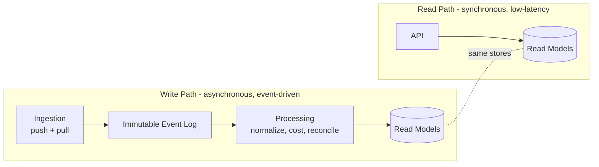
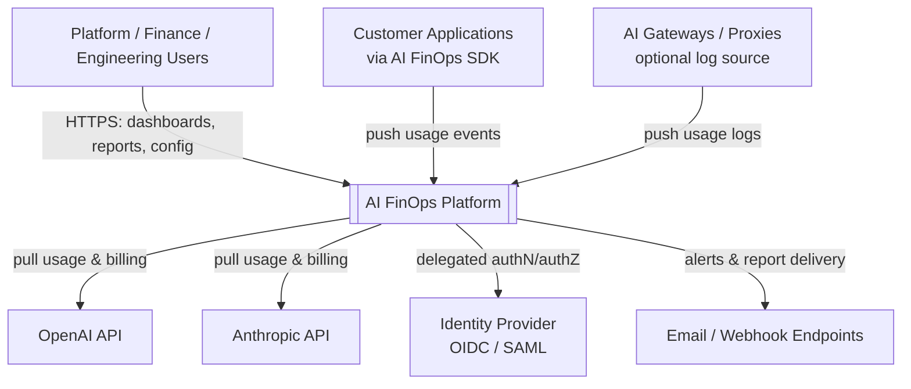
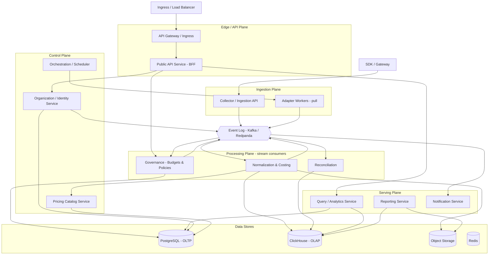
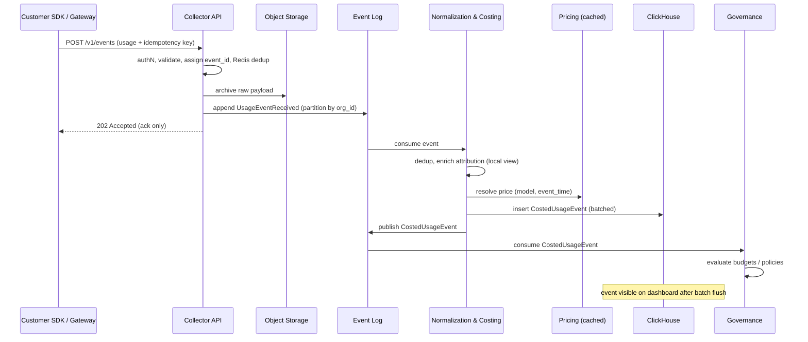
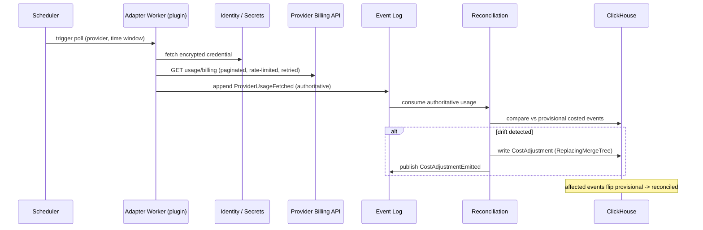
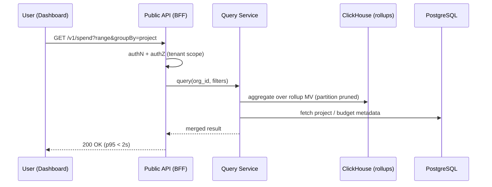
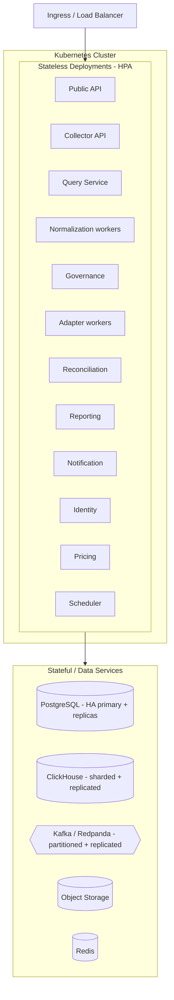

# AI FinOps — Software Design Document (SDD)
## Chapter 3: System Architecture — The Engineering Blueprint

| Field | Value |
|---|---|
| **Document title** | AI FinOps — Software Design Document |
| **Chapter** | 3 — System Architecture |
| **Version** | 0.1 (Draft) |
| **Status** | Draft for Review |
| **Author** | Khan — Founder |
| **Last updated** | June 26, 2026 |
| **Depends on** | Chapter 1 (Executive Summary), Chapter 2 (Goals, Scope & Principles) |
| **Feeds** | Chapter 4 (Data Model), Chapter 5 (API Contracts), Chapter 6 (Ingestion & Adapters) |

> **Purpose of this chapter.** This is the master blueprint. It defines the services that exist, the data each one owns, how they communicate, which service may write to which store, which interfaces are synchronous versus asynchronous, the events that flow through the system, the deployment topology, and the end-to-end path of a request. It is the binding realization of the principles in §2.4–§2.5 and the boundaries in §2.6. Chapters 4 (schema), 5 (API contracts), and 6 (adapters) are derived *from* this chapter, not invented alongside it. Where a decision is made, the rejected alternative and the reason are stated (§2.5 discipline).

---

## 3.1 Architectural Style

AI FinOps is an **event-driven system with CQRS-style read/write separation**, built around a **push + pull ingestion duality** and a **single-writer data-ownership model**.

Three structural commitments define the architecture:

1. **Asynchronous write path, synchronous read path.** Ingestion is event-driven and never blocks the caller (AP-1, AP-10). Serving is synchronous request/response optimized for sub-2-second dashboards (SC-2). The two paths are physically and operationally separate so they scale and fail independently (AP-5).

2. **Push + pull ingestion.** *Push* events (customer SDK callbacks, gateway logs) arrive in near-real-time but are partial and provisional. *Pull* events (adapter workers polling provider usage/billing APIs) are authoritative but lagged and rate-limited. A **reconciliation engine** merges them, upgrading provisional figures to reconciled ones. This duality is what makes the product simultaneously *real-time* and *finance-grade* (PP-1) — neither mode alone achieves both.

3. **Single-writer ownership.** Every dataset has exactly one service authorized to write to it (§3.5). All other access is read-only via the owner's API or via the analytical store. This is what prevents the system from degrading into a distributed monolith where any service can mutate any table.



---

## 3.2 System Context (C4 Level 1)

The platform's external actors and systems. Everything outside the central box is owned by someone else (§2.6) and is integrated, never replaced.



| External system | Direction | Purpose |
|---|---|---|
| Customer applications (SDK) | Inbound | Push real-time, provisional usage events. |
| AI gateways / proxies | Inbound | Optional secondary push source for customers already running a gateway. |
| Provider APIs (OpenAI, Anthropic) | Outbound | Pull authoritative usage/billing for reconciliation. |
| Identity provider | Bidirectional | Delegated authentication; AI FinOps does not build an IdP (§2.6). |
| Email/webhook endpoints | Outbound | Alert and report delivery; the channels themselves are external. |

---

## 3.3 Container / Service Architecture (C4 Level 2)

The system is organized into five planes. The services below are **logical bounded contexts** (responsibility boundaries). §3.10 maps them to a pragmatic Version-1 deployment in which several co-locate into fewer deployable units; the boundaries remain so they can be split later without redesign.



---

## 3.4 Service Catalog

Each service is defined by its single responsibility, the data it solely owns (writes), what it reads, its interface style, and its scaling model. "Owns" means sole-writer per §3.5.

### Edge / API Plane

| Service | Responsibility | Owns (writes) | Reads | Interfaces | Scaling |
|---|---|---|---|---|---|
| **API Gateway / Ingress** | TLS termination, edge authN, global rate limiting, routing. Off-the-shelf (Envoy/Kong/ingress), not custom. | — | — | Sync (HTTPS) | Stateless, horizontal |
| **Public API Service (BFF)** | The API-first surface (§AP-9). AuthZ, tenant scoping, orchestration of internal calls for config + reads. | — (orchestrator) | Query, Identity, Governance | Sync REST/GraphQL (external), gRPC (internal) | Stateless, horizontal |

### Ingestion Plane

| Service | Responsibility | Owns (writes) | Reads | Interfaces | Scaling |
|---|---|---|---|---|---|
| **Collector / Ingestion API** | High-throughput write endpoint for push events. Authenticate, validate, assign `event_id`, archive raw payload, publish to log. Returns `202` ack only. | `usage.raw` topic; raw archive (object storage) | Redis (idempotency window, rate limits) | Sync **ack only** (HTTP `202`); async downstream | Stateless, horizontal (primary scale-out point) |
| **Adapter Workers (pull)** | Per-provider plugins (§AP-4) polling provider usage/billing APIs; normalize to canonical envelope; publish authoritative events. | `usage.pulled` topic | Identity/Secrets (credentials, sync), Pricing | Async jobs (triggered by Scheduler) | Horizontal per provider; rate-limit-aware |

### Processing Plane (stream consumers)

| Service | Responsibility | Owns (writes) | Reads | Interfaces | Scaling |
|---|---|---|---|---|---|
| **Normalization & Costing** | The core read-model builder. Deduplicate (idempotency), enrich attribution (project/team), apply pricing at event-time, compute cost, write costed events. | `usage.costed` topic; **ClickHouse costed-event tables (sole writer)**; raw archive | `attribution.mappings` (compacted topic), Pricing (cached) | Async (Kafka consumer) | Horizontal by partition |
| **Reconciliation** | Compare provisional (push) vs authoritative (pull); emit adjustments; flip status to reconciled. | `cost.adjustments` topic; ClickHouse adjustment rows | ClickHouse (provisional events), `usage.pulled` | Async jobs + consumer | Horizontal |
| **Governance (Budgets & Policies)** | Evaluate costed stream/aggregates against budgets and policies; raise alerts/violations. | **Budgets & policies (PostgreSQL, sole writer)**; `governance.alerts` topic | `usage.costed`, ClickHouse aggregates | Async (consumer) + sync CRUD via BFF | Horizontal |

### Serving Plane

| Service | Responsibility | Owns (writes) | Reads | Interfaces | Scaling |
|---|---|---|---|---|---|
| **Query / Analytics Service** | Read-optimized queries powering dashboards/reports. Partition pruning, rollup selection, metadata join. | — (read-only) | ClickHouse (rollups), PostgreSQL (metadata) | Sync gRPC (from BFF) | Stateless, horizontal; Redis-cached |
| **Reporting Service** | Generate deterministic, exportable reports as async jobs; persist artifacts. | **Report artifacts (object storage, sole writer)** | ClickHouse, PostgreSQL | Async jobs | Horizontal |
| **Notification Service** | Dispatch alerts/reports to channels with retry/backoff; idempotent delivery. | Delivery state (its own keyspace) | `governance.alerts` | Async (consumer) | Horizontal |

### Control Plane

| Service | Responsibility | Owns (writes) | Reads | Interfaces | Scaling |
|---|---|---|---|---|---|
| **Organization / Identity** | System of record for orgs, projects, users, RBAC, API keys, attribution mappings, encrypted provider credentials. Publishes attribution changes. | **Identity/tenancy schema (PostgreSQL, sole writer)**; `attribution.mappings` (compacted) | — | Sync gRPC (CRUD); async (publishes changelog) | Horizontal (read replicas) |
| **Pricing Catalog** | Versioned, dated pricing per provider/model. Pricing is *data, not code* (§A5). | **Pricing schema (PostgreSQL, sole writer)**; `pricing.updates` (compacted) | — | Sync read (cached); async publish | Read-heavy; cache-fronted |
| **Orchestration / Scheduler** | Schedule adapter polls, reconciliation runs, report jobs, backfills with durable retries. | Workflow state (its own store, e.g., Temporal) | — | Async / workflow | Horizontal |

**Design notes on the non-obvious services:**

- **Collector returns only an acknowledgement.** It never costs or stores the event synchronously. It validates, assigns an idempotency key, archives the raw payload, appends to the log, and returns `202`. This keeps the public write endpoint fast and cheap regardless of downstream load (AP-1) and is the primary horizontal scale-out point under billions of events.

- **Normalization is the only writer to the costed-event store.** Everything a dashboard shows is derived here. It must read attribution mappings and pricing at very high throughput — which forces the cross-service-data pattern in §3.5.

- **Identity publishes a compacted changelog.** A stream processor cannot make a synchronous API call to the Identity Service per event. Instead, Identity publishes `attribution.mappings` (and Pricing publishes `pricing.updates`) as **compacted Kafka topics**; Normalization maintains a fast local materialized view from them. This decouples the hot path from the control plane's database while preserving single-writer ownership.

---

## 3.5 Data Ownership & Access Model

**Rule (binding):** Every dataset has exactly one service authorized to write it. All other access is (a) read-only via the owner's API/changelog, or (b) read-only against the analytical store for analytics. Direct cross-service writes — and direct reads into another service's OLTP tables — are prohibited.

| Dataset / Store | Sole Writer | Readers | Cross-service mechanism |
|---|---|---|---|
| Identity/tenancy: orgs, projects, users, RBAC, API keys, credentials (PostgreSQL) | **Organization / Identity** | Public API, Adapter Workers (creds), Normalization (attribution) | Sync gRPC for CRUD; **compacted `attribution.mappings` topic** for the hot path |
| Pricing catalog (PostgreSQL) | **Pricing Catalog** | Normalization, Adapter Workers | Cached sync read; **compacted `pricing.updates` topic** |
| Budgets & policies (PostgreSQL) | **Governance** | Public API, Query Service | Sync gRPC |
| Raw event log (Kafka topics) | **Collector**, **Adapter Workers** (producers) | Normalization, Reconciliation, Governance (consumers) | Topic subscription |
| Costed canonical events + rollups (ClickHouse) | **Normalization** (events); **Reconciliation** (adjustments only) | Query, Governance, Reporting | Read-only SQL |
| Raw payload archive (Object storage) | **Collector / Normalization** | Reconciliation, Reporting, replay tooling | Read-only (keys) |
| Report artifacts (Object storage) | **Reporting** | Public API (signed URLs) | Read-only (signed URL) |
| Cache / rate-limit / idempotency (Redis) | Each service in its own keyspace | Same | Namespaced keys |
| Workflow state (Scheduler store) | **Orchestration** | — | — |

The two writers into ClickHouse (Normalization for events, Reconciliation for adjustments) are reconciled by storage design rather than by locking: adjustments use a `ReplacingMergeTree` keyed by `event_id` so the latest version wins on merge (§3.8). This preserves a single logical truth without coordination.

---

## 3.6 Communication Model

**Principle:** the write path is asynchronous (event/log); the read path is synchronous (request/response). Internal service-to-service calls use **gRPC** (typed, low-latency); the external surface is **REST + GraphQL**. Asynchronous flow uses the **Kafka/Redpanda** log.

| Interaction | Pattern | Protocol | Why this pattern |
|---|---|---|---|
| Dashboard/client → Public API | Sync | HTTPS REST/GraphQL | Users expect immediate request/response. |
| Public API → Query / Identity / Governance | Sync | gRPC | Low-latency typed internal calls for config + reads. |
| SDK / Gateway → Collector | Sync **ack only** | HTTPS (`202`) | Fast acknowledgement; real work is deferred (AP-1). |
| Collector / Adapters → Event Log | Async | Kafka produce | Decouple ingestion from processing; absorb bursts; enable replay (AP-2). |
| Event Log → Normalization / Reconciliation / Governance | Async | Kafka consume | Independent scaling; backpressure tolerance. |
| Normalization → ClickHouse | Async, **batched** | ClickHouse insert | ClickHouse penalizes small inserts; batch for throughput (§3.8). |
| Governance → Notification | Async | Kafka (`governance.alerts`) | Decouple detection from delivery; retry-safe. |
| Identity → Normalization (attribution) | Async | Compacted Kafka topic | Hot path must not call the control plane synchronously per event. |
| Adapter Workers → Provider APIs | Sync (job-internal) | HTTPS | External pull; rate-limited and retried inside a job (AP-10). |
| Scheduler → Adapter/Reconciliation/Reporting | Async | Workflow trigger | Long-running, retryable background work. |

**Backpressure & failure:** consumers commit offsets only after successful processing; transient failures retry with backoff; poison messages route to a per-topic **dead-letter topic** (`dlq.*`) for inspection and replay (AP-11). Consumer lag is a first-class operational SLO.

---

## 3.7 Event Model & Taxonomy

### 3.7.1 Canonical event envelope (conceptual)

All ingestion converges on one canonical shape. Full DDL is Chapter 4; the conceptual envelope below is what makes that schema derivable.

| Field | Meaning |
|---|---|
| `event_id` | Deterministic idempotency key (hash of source + provider + provider request id + window). |
| `source` | `push_sdk` \| `push_gateway` \| `pull_adapter`. |
| `org_id`, `project_id` | Tenancy + attribution. `project_id` resolved at enrichment from API key/tag. |
| `provider`, `model` | Normalized provider and model identifiers. |
| `event_time`, `ingest_time` | Provider-reported time vs. system receipt time. |
| `usage` | `{ input_tokens, output_tokens, cached_tokens, requests, ... }`. |
| `raw_ref` | Pointer to the original payload in object storage. |
| `pricing_version` | The exact pricing record used to compute cost (auditability). |
| `cost` | `{ amount, currency }`, computed at event-time pricing. |
| `status` | `provisional` \| `reconciled`. |
| `adjustment_of` | `event_id` this corrects (reconciliation), if any. |
| `attributes` | Free-form attribution dimensions (team, feature, customer, tags). |

### 3.7.2 Event catalog

| Event | Produced by | Consumed by | Topic | Retention |
|---|---|---|---|---|
| `UsageEventReceived` | Collector | Normalization | `usage.raw` | Short (archived to object storage) |
| `ProviderUsageFetched` | Adapter Workers | Reconciliation, Normalization | `usage.pulled` | Short |
| `CostedUsageEvent` | Normalization | Governance, (audit) | `usage.costed` | Medium |
| `CostAdjustmentEmitted` | Reconciliation | (audit), ClickHouse | `cost.adjustments` | Medium |
| `AttributionMappingChanged` | Identity | Normalization | `attribution.mappings` | **Compacted (infinite)** |
| `PricingCatalogUpdated` | Pricing Catalog | Normalization | `pricing.updates` | **Compacted (infinite)** |
| `BudgetThresholdBreached` / `AlertRaised` | Governance | Notification | `governance.alerts` | Medium |
| `ReportRequested` / `ReportGenerated` | Public API / Reporting | Reporting / Public API | `reports.*` | Short |
| `*` (poison messages) | any consumer | operators | `dlq.*` | Long |

### 3.7.3 Topic & partitioning design

High-volume topics (`usage.raw`, `usage.costed`) are **partitioned by `org_id`** to give per-tenant parallelism and ordering, and to contain noisy-neighbor blast radius. Compacted topics (`attribution.mappings`, `pricing.updates`) are keyed by mapping/pricing identity so consumers always converge on the latest value. Partition count is sized for target peak throughput with headroom (§3.13).

---

## 3.8 Data Architecture & Storage

### 3.8.1 The "immutable event store" is a logical layer across three tiers

AP-2 mandates an immutable, append-only source of truth. In production this is realized across three physical tiers, because no single store is the right home for hot transport, permanent archive, and fast queries at once:

| Tier | Store | Role | Retention |
|---|---|---|---|
| **Hot transport** | Kafka / Redpanda | Durable, replayable log for in-flight processing | Bounded (days–weeks) |
| **Cold archive** | Object storage (S3 / MinIO) | Permanent, cheap, immutable record of every raw event; the source for full replay beyond Kafka retention | Indefinite |
| **Queryable read model** | ClickHouse | Costed events + pre-aggregated rollups for serving | Hot, with tiering |

Replay beyond the Kafka window (e.g., recomputing all history after a pricing-logic fix) reads from the **object-storage archive**, not Kafka. This is deliberate: Kafka is transport, not infinite storage.

### 3.8.2 Polyglot persistence (AP-6)

| Store | Owns | Workload shape |
|---|---|---|
| **PostgreSQL** | Identity/tenancy, budgets/policies, pricing catalog | Relational integrity, low-volume, transactional |
| **ClickHouse** | Costed usage events + rollups | Append-heavy, columnar, billions of rows, fast aggregation |
| **Object storage** | Raw payload archive, report artifacts | Cheap, immutable, large objects |
| **Redis** | Cache, rate-limit counters, idempotency window | Ephemeral, low-latency |

### 3.8.3 ClickHouse schema strategy (the key to <2s dashboards over billions of rows)

- **Partitioning:** `PARTITION BY toYYYYMM(event_time)` so time-bounded queries prune to a few partitions.
- **Ordering:** `ORDER BY (org_id, provider, model, event_time)` so tenant- and dimension-scoped scans are sequential.
- **Deduplication & corrections:** `ReplacingMergeTree(version)` keyed by `event_id` — duplicate deliveries and reconciliation adjustments resolve to the latest version on merge, giving effective exactly-once totals without distributed locks.
- **Pre-aggregation:** **materialized views** maintain rollups (per hour/day × org × project × provider × model). Dashboards query the rollup, not the raw table, which is what keeps p95 under 2 seconds at billion-row scale (SC-2). Raw events remain available for drill-down.
- **Batched inserts:** Normalization buffers and inserts in batches; ClickHouse is penalized by many small inserts.

### 3.8.4 Idempotency

Two layers: a short-window dedup in **Redis** at ingestion (fast rejection of obvious duplicates) and authoritative dedup via **`ReplacingMergeTree` on `event_id`** at storage. At-least-once delivery + idempotent processing ⇒ exactly-once *effect* on reported totals (E2, AP-3).

### 3.8.5 Tiering & retention

Hot costed data and rollups live in ClickHouse; aged raw detail tiers to object storage; rollups are retained longer than raw detail because dashboards query aggregates. Retention is configurable per deployment (self-host customers may set their own).

---

## 3.9 Request Lifecycles (End-to-End)

### 3.9.1 Push ingestion — from SDK call to dashboard



### 3.9.2 Pull + reconciliation — authoritative correction



### 3.9.3 Dashboard query — synchronous read path



### 3.9.4 Budget alert — detection to delivery

```mermaid
sequenceDiagram
    participant BUS as Event Log
    participant GOV as Governance
    participant PG as PostgreSQL (budgets)
    participant NOTI as Notification
    participant CHN as Channel (email/webhook)

    BUS->>GOV: CostedUsageEvent
    GOV->>PG: load budget/policy for org/project
    GOV->>GOV: update running spend; compare thresholds
    alt threshold breached
        GOV->>BUS: publish AlertRaised
        BUS->>NOTI: consume AlertRaised
        NOTI->>CHN: deliver (idempotent, retry w/ backoff)
    else within budget
        GOV->>GOV: continue
    end
```

### 3.9.5 Provider onboarding & backfill

When a customer connects a provider, Identity stores the encrypted credential and the Scheduler enqueues a **durable backfill workflow**: the adapter pages historical usage/billing (rate-limited, resumable on failure), publishing `ProviderUsageFetched` events that flow through Normalization and Reconciliation like any other pull data. Progress is reported to the user; failure resumes from the last checkpoint (AP-10/11).

---

## 3.10 Deployment Topology

### 3.10.1 Target topology

All services are containerized (Docker) and orchestrated on Kubernetes (§2.5 infra). Stateless services run as Deployments with horizontal autoscaling; stateful stores are operated as clustered, replicated services (or managed equivalents in SaaS).



### 3.10.2 Version-1 pragmatic co-location

To respect PP-9 (simple over complex) and a small team, V1 collapses the logical services into a few deployable units while keeping the boundaries intact:

| V1 deployable unit | Logical services co-located |
|---|---|
| **api** | Public API + Query Service + Identity + Pricing + Governance (CRUD side) |
| **ingest** | Collector API |
| **workers** | Normalization + Reconciliation + Governance (consumer side) + Adapter Workers |
| **jobs** | Scheduler + Reporting + Notification |
| **data** | PostgreSQL, ClickHouse, Kafka/Redpanda, Redis, Object storage |

Each unit can be peeled into its own service later with no interface change, because communication already crosses gRPC/Kafka boundaries.

### 3.10.3 Multi-tenancy & isolation

- **SaaS:** shared multi-tenant. Every row and event carries `org_id`; the Query Service enforces tenant scoping on every read; Kafka partitioning by `org_id` limits noisy-neighbor impact. PostgreSQL row-level isolation; ClickHouse scoped by `org_id` in the `ORDER BY` key.
- **Self-host (PP-4, AP-8):** single-tenant deployment of the entire stack inside the customer's cluster, using the self-hostable component set (Redpanda, MinIO, self-hosted ClickHouse/PostgreSQL) so there are no managed-only dependencies. Same images, different topology.

---

## 3.11 Cross-Cutting Concerns

**Security & tenant isolation.** Provider credentials are stored with envelope encryption (KMS-backed); secrets never appear in logs (PP-10). Internal traffic uses mTLS; authZ is enforced at the edge and re-checked per service. Content is not captured by default (PP-5), shrinking breach blast radius. The append-only event log doubles as a tamper-evident audit trail (PP-6).

**Idempotency & exactly-once effect.** Covered in §3.8.4 — Redis window + `ReplacingMergeTree`.

**Failure handling.** Retries with backoff, per-topic dead-letter topics, circuit breaking around provider calls, graceful read-path degradation (serve last-reconciled data with a freshness indicator) (AP-11).

**Platform observability (distinct from the product).** The platform emits its own metrics (Prometheus), traces, and logs to monitor *itself* — explicitly separate from the AI-cost data it manages for customers (§2.5 clarification). Consumer lag, ingestion throughput, reconciliation drift, and query latency are the core SLOs.

**Data retention.** Configurable per deployment; hot detail in ClickHouse, aged detail tiered to object storage, rollups retained longest (§3.8.5).

---

## 3.12 Technology Selections

Decisions inherit from §2.5; alternatives and trade-offs are stated per §2.5 discipline. Versions should be confirmed at implementation time.

| Concern | Choice | Alternatives considered | Why chosen | Trade-offs |
|---|---|---|---|---|
| **Event log** | Kafka API (Redpanda for self-host) | Kinesis, SQS, Pulsar, NATS | Durable, replayable, partitioned log required for AP-2 replay; self-hostable; Redpanda removes JVM/ZooKeeper ops burden | Operational weight vs. a plain queue; SQS rejected (no replay/ordering/log semantics) |
| **OLAP store** | ClickHouse | Druid, Pinot, BigQuery, Snowflake, TimescaleDB | Proven at billions of events at low cost; columnar; materialized-view rollups; self-hostable | Snowflake/BigQuery rejected (managed-only, per-query cost, not self-hostable, AP-8); Timescale hits a ceiling vs. columnar at this scale; Druid/Pinot heavier ops for a small team |
| **OLTP store** | PostgreSQL | MySQL | Relational integrity + JSONB flexibility; ubiquitous; self-hostable | Standard; no material downside |
| **Cache / ephemeral** | Redis | Memcached | Rate limits, idempotency window, query cache in one engine | — |
| **Object storage** | S3-compatible (MinIO self-host) | Cloud-specific blob | Cheap immutable archive + report artifacts; MinIO gives self-host parity (AP-8) | — |
| **Workflows / jobs** | Temporal (target); cron + queue (V1 option) | Airflow, Celery, custom cron | Durable, resumable backfills/reconciliation with retries (AP-10/11) | Temporal is heavy for V1 — start with cron+queue, adopt Temporal when backfill complexity grows (PP-9) |
| **Internal RPC** | gRPC | REST internal | Typed, fast service-to-service | Schema/versioning discipline required |
| **External API** | REST + GraphQL | REST only | REST for simple integration; GraphQL for flexible dashboard queries (AP-9) | Two surfaces to maintain |
| **Language — data plane** | Rust or Go | Python/Node | Hot path (billions of events) needs throughput/latency; Rust matches existing in-house strength | Smaller talent pool; slower iteration than scripting |
| **Language — API/control plane** | TypeScript/Node or Go | — | Developer velocity for the BFF and CRUD services | Polyglot increases toolchain surface — a single-language (Go everywhere) option exists if team size demands it |
| **Containers / orchestration** | Docker + Kubernetes | — | Horizontal scaling, self-host portability (§2.5) | Operational complexity |

---

## 3.13 Scale Envelope & Non-Functional Targets

These bind the architecture to the acceptance criteria in §2.9 and to the "billions of events" mandate.

| Dimension | Target | Mechanism |
|---|---|---|
| **Ingestion throughput** | Sustained high write rate with burst headroom; caller unaffected by downstream load | Stateless Collector + Kafka buffering + `202` ack (AP-1) |
| **Event scale** | Billions of costed events queryable | ClickHouse partitioning + ordering + rollup MVs (§3.8.3) |
| **Dashboard latency** | p95 < 2s (SC-2) | Query rollups, not raw; partition pruning; Redis cache |
| **Reconciliation accuracy** | Within ±2% where official data exists (SC-3) | Push+pull duality + Reconciliation engine (§3.1, §3.9.2) |
| **Freshness** | Bounded; provisional vs. reconciled shown (SC-7) | Async pipeline + status field + freshness indicator |
| **Ingestion correctness** | No double-counting under retries; replay-deterministic (SC-6) | Idempotency (§3.8.4); replay from archive (§3.8.1) |
| **Add-a-provider cost** | Zero changes to ingestion/analytics core (SC-5) | Adapter isolation (AP-4); compacted-changelog decoupling |
| **Availability under provider failure** | Read path degrades gracefully; ingestion buffers | Circuit breaking, DLQ, last-reconciled serving (AP-11) |

---

## 3.14 How Downstream Chapters Derive From This

This chapter is the source from which the rest of the SDD is mechanically derivable:

- **Chapter 4 — Data Model** expands the canonical event envelope (§3.7.1), the ClickHouse schema strategy (§3.8.3), and the PostgreSQL schemas implied by the single-writer ownership table (§3.5).
- **Chapter 5 — API Contracts** specifies the Public API surface (§3.4 Edge plane), the sync/async contract (§3.6), and the Collector ingestion contract (§3.9.1).
- **Chapter 6 — Ingestion & Adapter Framework** details the adapter plugin contract (§AP-4, §3.4) and the push/pull/reconciliation pipeline (§3.9).
- **Operational chapters** derive their SLOs from the scale envelope (§3.13) and the cross-cutting concerns (§3.11).

Because services, data ownership, communication patterns, and event flows are now fixed, the schema, API contracts, and implementation can proceed in parallel without re-litigating where a responsibility belongs.

---

_End of Chapter 3._
