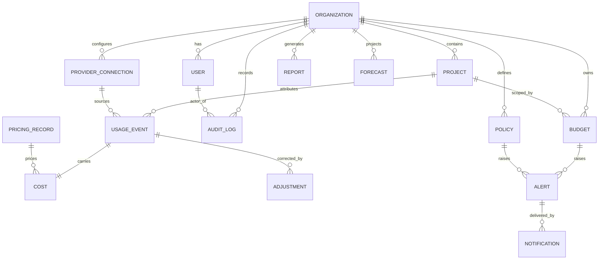
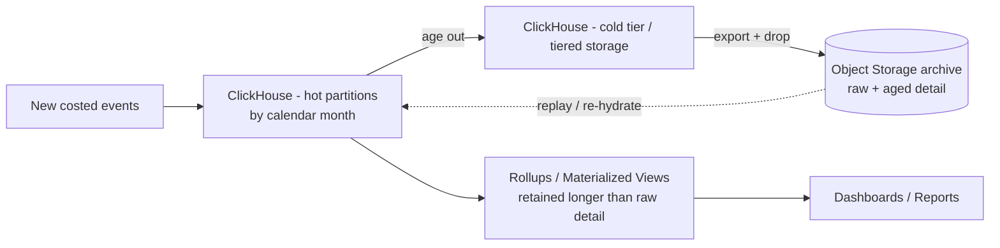
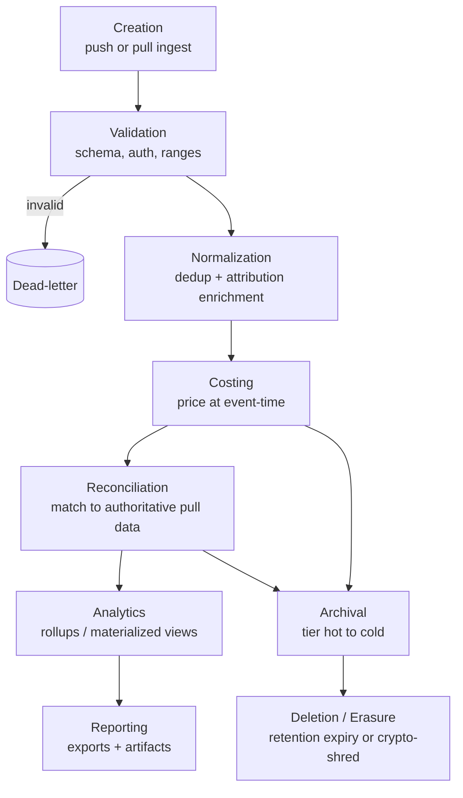

# AI FinOps — Software Design Document (SDD)
## Chapter 4: Data Architecture

| Field | Value |
|---|---|
| **Document title** | AI FinOps — Software Design Document |
| **Chapter** | 4 — Data Architecture |
| **Version** | 0.1 (Draft) |
| **Status** | Draft for Review |
| **Author** | Khan — Founder |
| **Last updated** | June 26, 2026 |
| **Depends on** | Chapters 1–3 |
| **Feeds** | Chapter 5 (API Contracts), Chapter 6 (Ingestion & Adapters), all data-touching services |

> **Purpose.** This chapter is the definitive specification for every piece of persistent data in the platform: what it is, where it lives, who owns it, how long it survives, how it is versioned, secured, partitioned, recovered, and governed. It expands the domain model (§3.15) and the storage strategy (§3.8) into an implementation-grade blueprint. It contains **no SQL, no DDL, and no code** — every decision is expressed logically so it can be implemented in any compatible engine. Where a storage-engine feature is named (e.g., a ClickHouse merge engine), it is a *design decision*, not a code artifact.

---

## 4.1 Data Architecture Principles

These principles govern every dataset. They are binding and inherit from the architecture principles in §2.5.

| ID | Principle | Why it exists |
|---|---|---|
| **DP-1** | **Immutable by default.** Data is never updated in place; change is expressed by appending a new version or a new record. | Auditability and finance-grade trust (§PP-6); the past must be reconstructable exactly. |
| **DP-2** | **Usage Events are append-only facts.** An event records what happened; it is never edited. Corrections are *Adjustment* events. | An observation of reality cannot be "wrong" — only superseded. Preserves history (§AP-2). |
| **DP-3** | **Every entity has a globally unique identifier.** Entities use UUIDs; events use a deterministic `event_id`. | Idempotency, cross-store correlation, and collision-free identity across regions. |
| **DP-4** | **Event schema is versioned.** Every event carries a schema version. | Schema can evolve without breaking existing producers or consumers (§4.10). |
| **DP-5** | **Every business entity belongs to exactly one bounded context, with one writer.** | Prevents the distributed-monolith failure mode (§3.5). |
| **DP-6** | **Every record belongs to exactly one Organization.** `org_id` is mandatory and first-class on all data. | Tenant isolation, attribution, and future regional residency (§3.10.3, §3.22). |
| **DP-7** | **Soft delete for entities; hard delete (crypto-shred) for compliance erasure.** Business entities carry `deleted_at`; subject erasure destroys recoverability. | Balances audit/history against the right-to-erasure (§4.15). |
| **DP-8** | **Single source of truth per datum.** Exactly one store is authoritative for any value; derived stores are never authoritative. Provider billing is the external SoT for reconciled cost. | Removes "which number is correct?" ambiguity (§4.16). |
| **DP-9** | **Event time ≠ processing time.** `event_time` (when usage occurred, per provider) is distinct from `ingest_time`/`processing_time` (when we saw and processed it). | Correct historical analytics, late-arrival handling, and reconciliation depend on this separation. |
| **DP-10** | **Cost is computed at event-time pricing and pins its pricing version.** | A later price change must never retroactively alter historical cost; reproducibility and audit. |
| **DP-11** | **All derived data is reproducible from immutable inputs.** Read models and rollups can be rebuilt by replay. | Disaster recovery, recomputation after logic fixes, and trust (§3.8.1). |
| **DP-12** | **Tenancy and region travel on every record.** | Enables future region pinning with no migration; keeps isolation enforceable everywhere. |

The two principles teams most often violate are **DP-8** (they let two stores both claim authority and then disagree) and **DP-9** (they conflate when a thing happened with when they processed it, corrupting time-series analytics). Both are treated as non-negotiable here.

---

## 4.2 Data Classification

Every dataset belongs to exactly one class. Classification drives storage, retention, and protection.

| Class | Purpose | Examples (our entities) | Storage | Retention | Owner | Sensitivity |
|---|---|---|---|---|---|---|
| **Master Data** | Core business entities | Organizations, Users, Projects, Provider Connections | PostgreSQL | Life of account + legal hold | Identity / Organization | Medium (PII) |
| **Transactional Data** | The high-volume event stream | Usage Events, Costs, Adjustments | Kafka → ClickHouse + object archive | Hot months–years; cold indefinite | Event / Ingestion | Low–Medium |
| **Reference Data** | Slowly-changing lookups | Pricing Records, provider/model catalog, FX rates | PostgreSQL (+ cache) | Versioned; never deleted | Provider / Pricing | Low |
| **Analytical Data** | Derived aggregates | Rollups, materialized views, forecasts (Phase 2+) | ClickHouse | Longer than raw detail | Analytics | Low |
| **Configuration Data** | Governance & settings | Budgets, Policies, alert configs, org settings | PostgreSQL | Life of account; versioned | Governance / Organization | Low |
| **Audit Data** | Tamper-evident record of actions | Audit Log, governance/access actions | PostgreSQL (append-only) + archive | Long (compliance, multi-year) | Platform / Security | Medium |
| **Temporary Data** | Ephemeral working state | Idempotency windows, rate-limit counters, job state, caches | Redis / workflow store | TTL (seconds–hours) | Each service | Low |
| **Secrets** | Credentials & keys | Provider API keys, signing/encryption keys | Encrypted store, KMS-backed | Until rotated/revoked | Identity / Secrets | **Critical** |
| **Metadata** | Data about data | Schema versions, processing metadata, lineage, quality flags | Alongside owning records | With the data | Producing service | Low |
| **Logs** | Platform application logs | Structured service logs | Log pipeline / object storage | Short–medium (e.g., 30–90d) | Platform observability | Low–Medium |
| **Metrics** | Platform telemetry | Prometheus metrics | Metrics store | Per monitoring policy | Platform observability | Low |

Logs and Metrics describe the *platform's own* health and are explicitly separate from the AI-cost data the platform manages for customers (§3.11).

---

## 4.3 Canonical Event Model

This is the most important section in the chapter. It defines the **logical Usage Event** — not a table. Every ingestion path (push and pull) converges on this single shape. Chapter 4.5 maps it to physical storage; here it is purely logical.

### 4.3.1 Field catalog

Fields are grouped by purpose. Mutability is one of **Immutable** (set once, never changes), **Derived** (computed by the system from other inputs), or **Lifecycle** (transitions only by appending a superseding version — see §4.3.2).

| Group | Field | Logical type | Required | Mutability | Description |
|---|---|---|---|---|---|
| **Identity** | `event_id` | string (deterministic) | Yes | Immutable | Idempotency key; deterministically derived from source identifiers (source + provider + provider request id + window). |
| | `schema_version` | integer | Yes | Immutable | Version of the canonical event *contract* (§4.10). |
| | `event_version` | integer | Yes | Derived | Record revision for the same `event_id`; the version that resolves corrections (latest wins). Starts at 1. |
| **Tenancy / attribution** | `org_id` | uuid | Yes | Immutable | Owning Organization (DP-6). |
| | `region` | string | Yes | Immutable | Residency region of the record (DP-12). |
| | `project_id` | uuid | Yes (post-enrichment) | Derived | Attribution target, resolved from API key/tag during enrichment. |
| | `tags` / `attributes` | map | No | Derived | Free-form attribution dimensions (team, feature, customer). |
| **Provider / model** | `provider` | string | Yes | Immutable | Normalized provider identifier. |
| | `model` | string | Yes | Immutable | Normalized model identifier. |
| **Usage measures** | `prompt_tokens` | integer | Yes | Immutable | Input tokens. |
| | `completion_tokens` | integer | Yes | Immutable | Output tokens. |
| | `cached_tokens` | integer | No | Immutable | Prompt-cache tokens (provider-dependent). |
| | `reasoning_tokens` | integer | No | Immutable | Reasoning/thinking tokens (provider-dependent). |
| | `total_tokens` | integer | Yes | Derived | Sum of token components (or provider-reported). |
| | `requests` | integer | Yes (default 1) | Immutable | Number of API calls represented by this event. |
| | `latency_ms` | number | No | Immutable | Request latency (available on push/SDK; often absent on pull). |
| **Cost** | `cost_amount` | decimal | Yes | Derived | Computed at event-time pricing (DP-10). |
| | `currency` | string | Yes | Derived | From the pricing record (default USD). |
| | `pricing_version` | uuid | Yes | Derived | The exact Pricing Record used (auditability). |
| **Correlation / source** | `request_id` | string | No | Immutable | Provider's request identifier, when available. |
| | `correlation_id` | string | No | Immutable | Caller-supplied trace id linking related events. |
| | `source` | enum | Yes | Immutable | `push_sdk` \| `push_gateway` \| `pull_adapter` (provenance). |
| | `raw_ref` | string | Yes | Immutable | Pointer to the raw payload in the object archive. |
| **Time** | `event_time` | timestamp | Yes | Immutable | When usage occurred (provider time) — DP-9. |
| | `ingest_time` | timestamp | Yes | Immutable | When the Collector received it. |
| | `processing_time` | timestamp | Yes | Derived | When Normalization costed it. |
| **Lifecycle** | `status` | enum | Yes | Lifecycle | `provisional` \| `reconciled` \| `archived` (§3.21.3). |
| | `adjustment_of` | string (event_id) | No | Immutable | The event this record corrects, if any. |
| **Processing** | `processing_metadata` | object | Yes | Derived | Pipeline diagnostics: normalization version, dedup result, data-quality flags, enrichment source, retry count. |

**Immutable fields** are the substance of the event (identity, tenancy, provider/model, raw token measures, times, source). **Derived fields** are computed (cost, total tokens, attribution, pricing version, processing metadata). **Optional fields** depend on provider/source capability (cached/reasoning tokens, latency, request id, correlation id, tags, adjustment reference).

### 4.3.2 Reconciling immutability with status transitions

The event is append-only (DP-2), yet `status` must transition (provisional → reconciled). These are reconciled by **never mutating in place**: a status change is a *new record with the same `event_id` and a higher `event_version`*, and the analytical store keeps the latest version on merge (the ReplacingMergeTree decision, §3.8.3). Corrections from reconciliation work identically — an Adjustment is a superseding versioned record. The logical truth is "the highest `event_version` for an `event_id`"; the physical history of all versions remains for audit.

### 4.3.3 Event versioning strategy

Two independent version axes, deliberately separated:

- **`schema_version`** versions the *contract* (the field set and meaning). It changes when the event shape changes.
- **`event_version`** versions the *record* (a specific event's revisions). It changes when an event is corrected or reconciled.

### 4.3.4 Schema evolution strategy

| Change type | Compatibility | Procedure |
|---|---|---|
| **Additive** (new optional field) | Backward-compatible | Bump `schema_version` minor; old consumers ignore the new field; ship via the shared contract (`packages/event-schema`, §3.23). |
| **Breaking** (remove/rename/repurpose a field) | Not compatible | Bump `schema_version` major; **dual-produce and dual-consume** during a transition window; if history must conform to the new shape, **replay from the object archive** to re-emit events (DP-11). |

Fields are **never removed or repurposed within a major version** — additive-only. A CI compatibility gate on the shared schema contract blocks incompatible changes before deploy. *Recorded as ADR-021 (event schema additive-only evolution).*

---

## 4.4 Conceptual Data Model

The conceptual entities and their relationships. This expands §3.15 with the governance, reporting, and audit entities.

| Entity | Ownership (bounded context) | Lifecycle summary |
|---|---|---|
| Organization | Organization | active → suspended → deleted (soft) |
| User | Identity | invited → active → disabled |
| Project | Organization | active → archived |
| Provider Connection | Provider | state machine §3.21.1 |
| Usage Event | Event / Ingestion | state machine §3.21.3 |
| Cost | Event / Ingestion (Normalization) | derived with its event; immutable per version |
| Pricing Record | Provider / Pricing | published → superseded (never edited) |
| Adjustment | Event / Ingestion (Reconciliation) | append-only correction |
| Budget | Governance | state machine §3.21.2 |
| Policy | Governance | active → disabled |
| Alert | Alert | raised → acknowledged → resolved |
| Forecast *(Phase 2+)* | Analytics | versioned run (deferred, §2.3) |
| Report | Reporting | requested → generating → ready → expired/failed |
| Notification | Alert (delivery) | pending → sent → failed → retrying |
| Audit Log | Platform / Security | append-only, immutable |

---

## 4.5 Logical Data Model

For each entity: purpose, owner, primary key, storage, and lifecycle. Relationships are in §4.4; key business rules follow the table. **No SQL.**

| Entity | Purpose | Owner Service | Primary Key | Storage | Lifecycle / States |
|---|---|---|---|---|---|
| Organization | The tenant | Identity | `org_id` (uuid) | PostgreSQL | active / suspended / deleted |
| User | Human principal + role | Identity | `user_id`; unique (`org_id`,`email`) | PostgreSQL | invited / active / disabled |
| Project | Attribution unit | Identity (Org context) | `project_id` (uuid) | PostgreSQL | active / archived |
| Provider Connection | Link to a provider | Provider (Adapters) | `connection_id` (uuid) | PostgreSQL (credential by reference) | §3.21.1 |
| Usage Event | Atomic usage fact | Event (Normalization writes) | `event_id` (string) | ClickHouse (+ Kafka transport + archive) | §3.21.3 |
| Cost | Monetary value of an event | Event (Normalization) | `event_id` (1:1) | ClickHouse (within the event record) | derived per version |
| Pricing Record | Dated price | Pricing | `pricing_id`; natural (`provider`,`model`,`effective_from`) | PostgreSQL (+ cache) | published / superseded |
| Adjustment | Reconciliation correction | Event (Reconciliation) | `event_id` + higher `event_version` | ClickHouse | append-only |
| Budget | Spend limit + thresholds | Governance | `budget_id` (uuid) | PostgreSQL | §3.21.2 |
| Policy | Governance rule | Governance | `policy_id` (uuid) | PostgreSQL | active / disabled |
| Alert | Raised signal | Alert | `alert_id` (uuid) | PostgreSQL | raised / acknowledged / resolved |
| Forecast *(Phase 2+)* | Spend projection | Analytics | `forecast_id` (uuid) | ClickHouse / analytical | versioned (deferred) |
| Report | Exportable artifact | Reporting | `report_id` (uuid); artifact key | PostgreSQL (meta) + object storage (artifact) | requested / generating / ready / expired |
| Notification | Channel delivery | Alert (Notification) | `notification_id` (uuid) | Notification store | pending / sent / failed / retrying |
| Audit Log | Action record | Platform / Security | `audit_id` (uuid) | PostgreSQL (append-only) + archive | immutable |

**Key business rules:**

- **Organization** — deletion is soft (preserves audit/history); true erasure follows §4.15.
- **Project** — belongs to exactly one Organization; attribution must resolve to a Project before an event is costed (else `ValidationError`/park, §3.20).
- **Provider Connection** — credential is stored by reference into the Secrets store, never inline with metadata.
- **Usage Event** — append-only; never edited; the logical value is the highest `event_version` per `event_id`.
- **Cost** — exists only as a derived property of a costed event; always traceable to a `pricing_version` (DP-10).
- **Pricing Record** — published prices are immutable; a price "change" inserts a new effective-dated record. Editing a historical price is forbidden (it would corrupt past costs).
- **Budget** — scoped to an Organization or a Project; thresholds drive the §3.21.2 state machine; each upward transition emits an Alert.
- **Audit Log** — append-only and immutable; it is itself a tamper-evident control.

---

## 4.6 Physical Storage Strategy

Each storage technology exists for a specific workload shape (the polyglot decision, §AP-6). The matrix below is the per-store specification.

| Dimension | PostgreSQL | ClickHouse | Redis | Object Storage | Kafka / Redpanda |
|---|---|---|---|---|---|
| **Purpose** | Relational integrity for entities | High-volume analytical queries | Ephemeral low-latency state | Cheap immutable archive + artifacts | Durable, replayable event transport |
| **Data stored** | Master, reference, config, audit | Costed events + rollups (analytical) | Idempotency window, rate limits, cache, job state | Raw payload archive, aged event detail, reports | In-flight events (all topics) |
| **Retention** | Life of account + legal hold | Hot months–years; tiered after | TTL (seconds–hours) | Indefinite (archive); per-policy (reports) | Bounded (days–weeks) + compacted topics infinite |
| **Replication** | Primary + read replicas; sync/async | Sharded + replicated | Replicated (optional) | Cross-region replication | Partition replication factor ≥ 3 |
| **Backup** | WAL archiving + base backups | Backups to object storage **and** rebuildable by replay | Generally none (reconstructable) | Versioning + cross-region copy | The archive is the backup (events archived on ingest) |
| **Recovery** | Point-in-time (WAL) | Restore backup **or** replay from archive | Rebuild from source | Restore from version/replica | Re-consume from offset; rebuild from archive beyond retention |
| **Scaling** | Vertical + read replicas; partition hot tables | Horizontal sharding + replication | Cluster / sharding | Effectively unbounded | Add partitions / brokers |
| **Trade-offs** | Not for billion-row scans | No FKs/transactions; denormalized | Volatile; not a system of record | High latency; not queryable directly | Not infinite storage; ops weight |

The defining property: **ClickHouse and the rollups are derived and rebuildable** (DP-11), so their worst-case recovery is replay from the object archive. PostgreSQL holds the authoritative entity state and gets the strongest transactional backup discipline. Object storage is the durable backbone and is the most protected store — its loss is the only truly catastrophic case.

---

## 4.7 Index Strategy

**Philosophy:** every index is justified by a query pattern; indexes are a write-time cost (which matters at billion-event scale, §AP-7), so speculative indexing is prohibited. Relational and analytical stores index in fundamentally different ways. **No SQL — principles only.**

| Store | Indexing approach | Designed for |
|---|---|---|
| **PostgreSQL** | B-tree primary keys on every entity; indexes on foreign keys; composite indexes ordered to match common filters (e.g., organization + status, organization + created-at); partial indexes that exclude soft-deleted rows. | Point lookups and bounded relational queries. |
| **ClickHouse** | No traditional secondary indexes. The **sort order** `(organization, provider, model, event-time)` *is* the sparse primary index; queries rely on partition pruning + sort-order locality; secondary access patterns use projections or skip-indexes, added only when a real query needs them. | Tenant-and-time-scoped aggregations. |
| **Redis** | The key namespace is the index; keys are designed for direct access (no scanning in the hot path). | O(1) lookups. |

**Principles:**

1. Index the dominant query, not every possible query. For the analytical store, the single most important design choice is the **sort order**, because it determines which queries are fast; it is chosen to serve the dashboard's primary access pattern (a tenant's spend over a time range, grouped by project/model).
2. Pre-aggregation replaces ad-hoc indexing in OLAP: materialized-view rollups (§4.8) answer dashboard queries without scanning raw events.
3. Avoid high-cardinality index explosion; attribution dimensions are bounded by design.
4. Foreign-key indexes exist in PostgreSQL for join performance and integrity; ClickHouse has no foreign keys and is intentionally denormalized.

---

## 4.8 Partition Strategy

**Why partition:** at billions of events, partitioning bounds query scope (pruning), enables cheap time-based retention and tiering (drop/move a whole partition), and unlocks parallelism.

| Concern | Strategy |
|---|---|
| **Usage Events (ClickHouse)** | Partition by **calendar month of `event_time`**; sort within partition by `(organization, provider, model, event_time)`. Time-bounded queries prune to a few partitions; aged partitions tier or drop cheaply. |
| **PostgreSQL** | Master/reference/config tables are low-volume and are **not** partitioned. The **Audit Log** (append-heavy, time-ordered) uses time-range partitioning. |
| **Archival** | Aged ClickHouse partitions tier to cold storage, then export to the object archive and drop from hot. The raw payload archive is written on ingest and is permanent. |
| **Cold storage** | Object storage holds the permanent raw archive plus aged event detail in a columnar format; queried rarely, by re-hydration or external query. |
| **Historical queries** | Recent ranges served from hot ClickHouse and rollups; deep history served from **rollups** (retained longer than raw detail) or by re-hydrating cold partitions / querying the archive. |
| **Very large tenants** | Kafka partitions by `org_id` (§3.7.3) and ClickHouse sharding (§3.10) contain noisy-neighbor impact; outsized tenants may warrant dedicated shards. *(Open question OQ-3.)* |

---

## 4.9 Data Lifecycle

Data moves through nine stages, crossing stores as it goes. The diagram traces a usage record from creation to deletion.

| Stage | What happens | Store touched | Resulting state | Owner |
|---|---|---|---|---|
| Creation | Event received (push) or fetched (pull); raw payload archived | Kafka, Object storage | Received | Collector / Adapters |
| Validation | Schema, auth, range checks | (in-stream) | Validated / DeadLetter | Collector / Normalization |
| Normalization | Dedup; attribution enrichment | Kafka, local views | Validated | Normalization |
| Costing | Price at event-time; compute cost | ClickHouse (write), Pricing (read) | Costed (provisional) | Normalization |
| Reconciliation | Compare vs authoritative; emit adjustments | ClickHouse | Reconciled | Reconciliation |
| Analytics | Maintain rollups | ClickHouse | (read models current) | Analytics |
| Reporting | Generate exports | ClickHouse → Object storage | (artifact ready) | Reporting |
| Archival | Tier aged detail to cold | ClickHouse → Object storage | Archived | Platform |
| Deletion | Retention expiry or subject erasure | All relevant | (removed / shredded) | Platform / Security |

States align with the Usage Event state machine (§3.21.3).

---

## 4.10 Data Versioning

Six independent version axes. Conflating them is a common and costly mistake; they are kept separate.

| Version type | What it versions | Increment trigger | Compatibility rule |
|---|---|---|---|
| **Schema Version** | The event/data contract | Field-set or meaning change | Additive = backward-compatible; breaking = major bump + transition window (§4.3.4) |
| **API Version** | External REST/GraphQL surface | Breaking API change | At least N-1 supported; documented deprecation window |
| **Event Version** | A specific event record's revisions | Correction / reconciliation | Latest version wins (ReplacingMergeTree, §4.3.2) |
| **Pricing Version** | A Pricing Record | New effective-dated price | Immutable once published; cost pins the version used |
| **Forecast Version** *(Phase 2+)* | A forecast run | New model run | Versioned for reproducibility and comparison |
| **Migration Version** | Database/schema migration sequence | Each migration | Monotonic, forward-only with rollback path (§4.13) |

**Backward compatibility** is the default contract across all axes: producers and consumers must tolerate older and additively-newer versions. Breaking changes require a deprecation window during which both versions run, never a hard cutover. *Recorded as ADR-022 (versioning & compatibility policy).*

---

## 4.11 Data Retention Policy

Retention is configurable per deployment (self-host customers may override). The defaults below are the design baseline.

| Data type | Hot retention | Archive | Deletion trigger | Compliance basis | Recoverable from |
|---|---|---|---|---|---|
| Usage Events (detail) | Months–years (ClickHouse) | Indefinite (object archive) | Retention expiry / tiering | Customer + financial records | Object archive (replay) |
| Raw payloads | — | Indefinite | Subject erasure only | Audit / reconciliation | Object archive (source of truth) |
| Rollups / aggregates | Longer than raw detail | Derived | Policy | Reporting continuity | Rebuild from archive |
| Master data | Life of account | — | Account closure + legal hold | Contract / audit | PostgreSQL backups |
| Pricing records | Indefinite (versioned) | — | Never | Cost reproducibility | PostgreSQL backups |
| Budgets / policies | Life of account | — | Account closure | Governance | PostgreSQL backups |
| Alerts / notifications | Medium | Optional | Policy | Operational | PostgreSQL backups |
| Reports | Per-policy (e.g., expiry) | Optional | Expiry | Customer | Regenerate from data |
| Audit Log | Long (multi-year) | Archive | Compliance window expiry | Regulatory | Append-only store + archive |
| Secrets | Until rotated/revoked | — | Rotation / revocation | Security | Re-provision (not recoverable) |
| Temp / cache | TTL | — | TTL expiry | — | Reconstructable |
| Logs / metrics | Short–medium | Optional | Policy | Ops | Not recovered |

---

## 4.12 Backup & Disaster Recovery

The architecture's recovery advantage is that **derived state is reproducible from the immutable archive** (DP-11). This makes the object archive the linchpin of DR.

| Store | Backup method | PITR | DR mechanism | Rebuildable from | RPO target | RTO target |
|---|---|---|---|---|---|---|
| PostgreSQL | WAL archiving + base backups | Yes | Cross-region replica + failover | Backups | Near-zero (WAL) | Minutes–hours |
| ClickHouse | Periodic backups to object storage | Limited | Replication; **or replay from archive** | Object archive | Near-zero (archived on ingest) | Hours (full rebuild), minutes (failover) |
| Kafka / Redpanda | Replication; archive captures events | — | Re-consume from offset | Object archive (beyond retention) | Near-zero | Minutes |
| Object Storage | Versioning + cross-region replication | Versioned | Replica promotion | (itself; replicated) | Near-zero | Minutes |
| Redis | None (reconstructable) | — | Rebuild from source | Source stores | N/A | Seconds–minutes |

**Replay strategy.** Two cases use replay: (1) **recovery** — rebuild ClickHouse read models and rollups from the object archive after loss; (2) **recomputation** — re-derive all history after a costing/normalization logic fix or a breaking schema change. Because raw payloads are archived on ingest, replay reconstructs the full costed history deterministically. **Point-in-time recovery** for relational state uses PostgreSQL WAL; for analytical state, "point-in-time" is achieved by replaying the archive up to a chosen event-time watermark. *Recorded as ADR-023 (replay-based DR for derived stores).*

---

## 4.13 Migration Strategy

All migrations are **forward-only with a defined rollback path**, and zero-downtime by construction via the **expand-contract** pattern.

| Migration type | Approach |
|---|---|
| **Database / schema (PostgreSQL)** | Expand-contract: add the new structure, backfill, switch reads/writes behind a flag, then remove the old structure in a later release. Never destructive in one step. Tracked in a monotonic migration ledger. |
| **Event schema** | Additive within a major version; breaking changes use dual-produce/dual-consume and optional replay from archive (§4.3.4). |
| **Pricing** | Append-only — insert new effective-dated records; never edit historical prices. |
| **ClickHouse** | Online column changes where supported; large/structural changes via new table + backfill-from-archive + atomic swap (cheap because the store is reproducible). Materialized-view changes rebuild from source. |
| **Zero-downtime** | Backward-compatible deploys, dual-running, feature flags; readers tolerate both old and new shapes during the window. |
| **Rollback** | Forward-fix is preferred; otherwise compensating migrations; restore from backup as last resort; derived stores rebuild from archive. |

The expand-contract sequence (add → backfill → switch → remove) is the single rule that makes relational migrations safe under continuous traffic. *Recorded as ADR-019 (expand-contract, forward-only migrations).*

---

## 4.14 Performance Strategy

The system is designed so that scaling is mostly **configuration** (more partitions, shards, and workers), not redesign — the payoff of the event-driven, stateless, partitioned architecture from Chapter 3.

| Daily events | Characteristics | What is sufficient | What changes / is added |
|---|---|---|---|
| **10K** | Trivial volume | Single-node PostgreSQL + single ClickHouse; V1 co-located services (§3.10.2); small Kafka | Nothing special |
| **100K** | Light | Batched inserts; rollups via materialized views; single ClickHouse | Tune batch sizes; size Kafka partitions |
| **1M** | Moderate | Partitioning + rollups become load-bearing; scale ingestion/normalization workers | Plan ClickHouse replication; right-size partitions |
| **100M** | Heavy | ClickHouse **sharding + replication**; Kafka partitioned by `org_id`; separate worker fleets; tiering of aged partitions | Dedicated handling for outsized tenants; cold-tier aggressively |
| **1B** | Very heavy | Full sharded ClickHouse cluster; pre-aggregation everywhere; horizontal everything; capacity planning | Possible regional sharding; storage cost optimization; rollup-only dashboards |

The constant across all tiers: **dashboards query rollups, never raw events** (§4.8), which is what keeps p95 < 2s (SC-2) independent of total volume.

---

## 4.15 Data Security

Security inherits from §3.11 and is specified per concern here.

| Concern | Approach |
|---|---|
| **Encryption in transit** | TLS externally; mTLS between internal services. |
| **Encryption at rest** | Storage-level encryption for all stores; **envelope encryption** (KMS-backed) for secrets and PII. |
| **PII** | Minimal by design — emails, names. Prompt/response content is **not stored by default** (§PP-5), so prompt-borne PII is largely avoided. PII fields are classified and access-controlled. |
| **Secrets / API keys** | Provider credentials stored with envelope encryption, KMS-managed keys, **never logged**, access-controlled, rotatable, and physically separated from analytical data. |
| **Access control** | RBAC with least privilege; authZ enforced at the edge and re-checked per service. |
| **Data isolation / multi-tenancy** | `org_id` on every record; relational row-level isolation; analytical queries inject and enforce `org_id`; Kafka partition isolation; self-host = physical isolation. |
| **GDPR / residency** | Region pinning via the `region` field (§3.22); data minimization; processor-role obligations; right-to-erasure via crypto-shredding (below). |
| **Audit logging** | Immutable, append-only audit log of access and governance actions; tamper-evident. |

**Right-to-erasure on immutable data (the hard problem).** Events are immutable and archived, so true per-row deletion of an entire archive is impractical and conflicts with DP-1/DP-2. The resolution is **crypto-shredding**: PII associated with a subject/tenant is encrypted under a per-tenant key; erasure destroys that key, rendering the PII permanently unrecoverable while leaving the immutable event structure and anonymized aggregates intact. This satisfies erasure without breaking immutability or reconstructability of cost history. The cost is per-tenant key management on read paths, which is flagged as an open question (OQ-2). *Recorded as ADR-020 (crypto-shredding for subject erasure).*

---

## 4.16 Data Governance

| Aspect | Specification |
|---|---|
| **Ownership** | Single-writer per dataset (§3.5); each dataset has an owning bounded context. |
| **Data stewardship** | The owning context is the steward, accountable for its data's quality and contracts. |
| **Source of truth** | One authoritative store per datum (DP-8); provider billing is the external SoT for reconciled cost; the analytical store is derived, never authoritative. |
| **Validation rules** | At ingestion: schema, required fields, non-negative tokens, known provider/model, sane timestamps. At enrichment: attribution resolves; pricing exists. Failures reject or dead-letter per the error taxonomy (§3.20). |
| **Reconciliation** | Push-vs-pull merge with drift detection (§3.9.2); ±2% accuracy target (SC-3). |
| **Consistency** | Strong consistency within relational entities (transactions); **eventual consistency** between the event store and read models (CQRS, §AP-5); single logical truth per event via latest-version-wins. |

**Data-quality dimensions (tracked as metrics):**

| Dimension | Definition | Target |
|---|---|---|
| Completeness | Events fully attributed and costed | ≥ 99% |
| Accuracy | Reconciled cost vs provider billing | within ±2% (SC-3) |
| Timeliness | Time from usage to dashboard | within freshness SLA (SC-7) |
| Uniqueness | No double-counting | duplicate rate ≈ 0 (§3.8.4) |

---

## 4.17 Engineering Contracts

The data law every service follows. This restates §3.5 and §3.6 as explicit per-service data contracts; violating it produces the distributed-monolith failure mode.

| Service | Owns (sole writer) | May read | Must never modify | Allowed communication | Forbidden communication |
|---|---|---|---|---|---|
| **Identity / Organization** | Identity & tenancy schema; `attribution.mappings` (compacted) | — | Events, costs, rollups | Sync gRPC (CRUD); publish changelog | Writing analytical data |
| **Pricing** | Pricing schema; `pricing.updates` (compacted) | — | Events, budgets | Cached read; publish changelog | Editing historical prices |
| **Collector** | `usage.raw`; raw archive | Redis (idempotency) | Costed events, any DB entity | Async produce; ack-only sync | Costing or DB writes (§AP-1) |
| **Adapter Workers** | `usage.pulled` | Secrets, Pricing | Any read-model | Async produce; sync credential fetch | Direct ClickHouse/Postgres writes |
| **Normalization** | Costed events (ClickHouse); `usage.costed` | Attribution + pricing (local views) | Relational entities; pricing | Consume/produce Kafka; write ClickHouse | Synchronous control-plane calls on the hot path |
| **Reconciliation** | Adjustments (ClickHouse) | Provisional events; pulled data | Relational entities | Consume/produce; write ClickHouse | Mutating original events in place |
| **Governance** | Budgets & policies (PostgreSQL); `governance.alerts` | Costed events; aggregates | Events, pricing | Consume; sync CRUD via BFF; produce alerts | Writing event/analytical data |
| **Query / Analytics** | — (read-only) | ClickHouse; relational metadata | **Everything** (read-only) | Sync gRPC from BFF | Any write to any store |
| **Reporting** | Report artifacts (object storage) | ClickHouse; relational | Source data | Async jobs | Writing source data |
| **Notification** | Delivery state | `governance.alerts` | Alerts, budgets | Consume; dispatch | Writing governance data |
| **Public API (BFF)** | — (orchestrator) | via owning services | All persistent stores directly | Sync gRPC to services | Direct database access of any kind |

The single most important forbidden pattern: **no service reads or writes another service's database directly** — cross-context data is reached via the owner's API or via a published (compacted) changelog. This is what preserves the bounded-context boundaries under real load.

---

## 4.18 Open Questions

Genuine unresolved decisions, to be ratified by ADRs as evidence accrues:

| ID | Question |
|---|---|
| **OQ-1** | For providers without granular billing APIs, what is the reconciliation granularity — per-event vs. coarse monthly true-up — and how is the degraded mode surfaced to the customer? |
| **OQ-2** | Crypto-shred vs. hard-delete for erasure on the immutable archive: final key-management model and its hot-path performance impact. |
| **OQ-3** | ClickHouse sharding key at very large scale (`org_id` vs. time vs. hybrid) and handling of outsized single tenants. |
| **OQ-4** | Rollup design: which dimensions and time-buckets to pre-aggregate, trading storage cost against query flexibility. |
| **OQ-5** | Multi-currency: FX-rate source, base-currency conversion policy, and historical FX handling (pricing is per-provider currency; org reporting currency may differ). |
| **OQ-6** | Exact hot-vs-cold tiering thresholds, pending real query-pattern data. |
| **OQ-7** | Schema-registry tooling: dedicated registry vs. shared contract package + CI gate. |
| **OQ-8** | Workflow engine: Temporal vs. cron+queue (ADR-014 still Proposed). |
| **OQ-9** | Late-arriving / out-of-order bounds: how late may reconciliation accept data; watermarking policy. |
| **OQ-10** | Forecast data model and storage (Phase 2+) — deferred but must not be foreclosed. |
| **OQ-11** | Per-tenant encryption-key model for crypto-shred and its effect on read-path latency. |

---

_End of Chapter 4. The canonical event model (§4.3), the logical entities (§4.5), and the engineering contracts (§4.17) are the inputs Chapter 5 uses to define the API surface, and Chapter 6 uses to define the ingestion and adapter contracts. New decisions here are recorded as ADR-019 through ADR-023 in the register (§3.24)._
