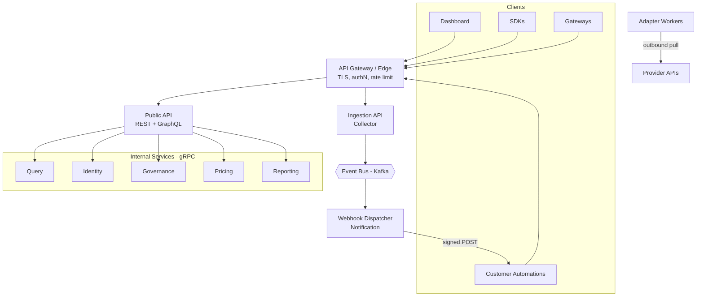

# AI FinOps — Software Design Document (SDD)
## Chapter 5: API Contracts & Service Interfaces

| Field | Value |
|---|---|
| **Document title** | AI FinOps — Software Design Document |
| **Chapter** | 5 — API Contracts & Service Interfaces |
| **Version** | 0.1 (Draft) |
| **Status** | Draft for Review |
| **Author** | Khan — Founder |
| **Last updated** | June 26, 2026 |
| **Depends on** | Chapters 1–4 |
| **Feeds** | Chapter 6 (Ingestion & Adapters), OpenAPI specification, SDK & frontend implementation |

> **Purpose.** This chapter is the binding contract between frontend, backend, SDKs, provider adapters, and future services. Every interface is **implementation-independent** — specified by resources, operations, request/response envelopes, error semantics, and event payloads, so that a backend, frontend, or SDK engineer can build against it without coordinating on internals. It contains **no implementation code, no OpenAPI YAML, and no JSON blocks** — request and response shapes are given as field tables. It is the direct source for the OpenAPI specification. New decisions are recorded as **ADR-031 through ADR-043**.

---

## 5.1 API Design Principles

| ID | Principle | Why it exists |
|---|---|---|
| **API-1** | **API-first.** Every capability is exposed via a documented API; the dashboard is one consumer among many. | Enables SDKs, automation, and the future ecosystem (§AP-9). |
| **API-2** | **REST-first for resources; GraphQL for analytics; gRPC internally.** | REST is predictable for CRUD; GraphQL lets dashboards shape flexible queries; gRPC is typed and fast for service-to-service (§3.6). |
| **API-3** | **Resource-based.** URLs name nouns (resources), not verbs. | Predictability and consistency across the surface. |
| **API-4** | **Versioned.** A major version is in the URI path. | Stability — clients are never broken by evolution (§4.10). |
| **API-5** | **Idempotent writes.** Mutating and ingestion calls accept an idempotency key. | Safe automatic retries under at-least-once networks (§3.8.4, §4.3). |
| **API-6** | **One error model everywhere.** Every endpoint returns the same error shape and codes. | Clients handle failure uniformly (§3.20). |
| **API-7** | **Cursor pagination by default.** | Stable over large, frequently-inserted datasets — offset pagination drifts at scale (§4.8). |
| **API-8** | **Consistent filtering, sorting, search.** Documented per resource. | Predictable query semantics across resources. |
| **API-9** | **Field expansion & sparse fieldsets.** Clients request only the fields/relations they need. | Avoids over-fetching and client-side N+1 (§PP-8). |
| **API-10** | **Rate limited & fair.** Every caller is bounded per org/key/user. | Protects the platform and enforces multi-tenant fairness (§4.15). |
| **API-11** | **Stateless requests.** Every call carries its own auth and context. | Horizontal scalability of the API plane (§AP-7). |
| **API-12** | **Secure by default.** The safe configuration requires no extra steps. | Multi-provider credentials make this a high-value target (§PP-10). |
| **API-13** | **Backward compatibility is a contract.** Additive within a major version; breaking changes are versioned and announced. | The API is treated like a public, frozen interface (§4.26). |

*Recorded as ADR-031 (API design principles & surface taxonomy).*

---

## 5.2 API Architecture



| API surface | Protocol | Consumers | Auth | Sync/Async |
|---|---|---|---|---|
| **External / Public** | REST + GraphQL over HTTPS | Dashboard, SDKs, customer automations | OAuth/JWT or API key | Sync |
| **Ingestion** | HTTPS (REST/NDJSON) | SDKs, gateways | Ingestion API key | Sync ack, async processing |
| **Internal / Service-to-Service** | gRPC | Internal services | mTLS + service identity | Sync |
| **Provider** | HTTPS (outbound) | Adapter Workers → providers | Provider credentials | Sync (within jobs) |
| **Webhook** | HTTPS (outbound) | Customer endpoints | HMAC signature | Async |
| **Administrative** | REST (privileged) | Internal operators | Elevated auth + audit | Sync |

**When each is used.** **REST** for external resource CRUD, ingestion, webhooks, and admin. **GraphQL** for flexible dashboard/analytics queries where clients shape the response. **gRPC** for internal service-to-service (typed, low-latency). **Async messaging (Kafka)** for event propagation, ingestion processing, and triggering webhook dispatch (§3.6). The boundary rule: *external and resource-shaped → REST; internal and typed → gRPC; analytics and client-shaped → GraphQL; propagation and decoupling → events.*

---

## 5.3 Authentication & Authorization

### 5.3.1 Authentication methods

| Method | Used by | Credential | Lifetime |
|---|---|---|---|
| **OAuth2 / OIDC** (delegated to IdP) | Interactive dashboard users | Authorization code → JWT | Session-based |
| **JWT access token** | Authenticated user sessions | Short-lived bearer token | ~15 min |
| **Refresh token** | Session renewal | Rotating refresh token | Longer; rotated on use |
| **Secret API key** (`sk_…`) | Server-side programmatic clients | Long-lived, scoped, revocable | Until rotated |
| **Ingestion API key** (`ik_…`) | SDKs embedded in customer apps | **`ingest:write` scope only**, revocable | Until rotated |
| **Service identity (mTLS)** | Internal service-to-service | Mutual TLS certificate | Cert lifecycle |

```mermaid
sequenceDiagram
    participant U as User (Dashboard)
    participant IDP as Identity Provider (OIDC)
    participant API as Public API (BFF)
    U->>IDP: OAuth2 / OIDC login
    IDP-->>U: auth code
    U->>API: exchange code → JWT (short) + refresh token
    U->>API: request + Bearer JWT
    API->>API: validate JWT; resolve org + role + scopes; authorize
    API-->>U: response
    Note over U,API: programmatic clients send an API key instead of a JWT
```

**Security-critical split: ingestion keys are write-only.** An SDK key ships inside customer applications and is therefore exposed. It carries **only** the `ingest:write` scope — it cannot read spend, configuration, or any other resource. Full programmatic access uses server-side `sk_` keys. A leaked `ik_` key is a non-event; a leaked `sk_` key is not — so the two are never the same credential.

### 5.3.2 Authorization model (RBAC + scopes)

**Roles** (assigned to users):

| Role | Description |
|---|---|
| **Owner** | Full control, including org lifecycle and billing. |
| **Admin** | Manage projects, providers, budgets, policies, users. |
| **Billing / Finance** | Budgets, analytics, reports, pricing (read); read-only elsewhere. |
| **Member** | Projects, ingestion, read analytics/alerts/reports. |
| **Viewer** | Read-only across resources. |
| **Service Account** | Machine principal with an explicit scope set. |

**Scopes** follow `resource:action` (e.g., `budgets:read`, `budgets:write`, `analytics:read`, `ingest:write`, `reports:generate`, `audit:read`, `webhooks:write`). Roles map to scope sets; every endpoint declares the scope it requires (§5.8). **Org scoping** is mandatory: every token is bound to exactly one organization, and the Query Service enforces tenant isolation on every read (§4.15) — cross-org access is structurally impossible.

**Token expiration & refresh.** Access tokens are short-lived; refresh tokens rotate on use and are revocable; API keys are revocable and hashed at rest (shown once, never returned). *Recorded as ADR-032 (authentication & authorization model).*

---

## 5.4 API Standards

| Standard | Rule | Example |
|---|---|---|
| **URL naming** | Plural resource nouns; hyphens for multiword path segments; `snake_case` for body/query fields | `/v1/provider-connections` |
| **Org scoping** | Org resolved from the auth token; not repeated in the path (except admin/org-management) | `/v1/projects` (org implicit) |
| **HTTP verbs** | GET read · POST create/action/ingest · PUT replace · PATCH partial update · DELETE soft-delete | — |
| **Status codes** | 200, 201, 202 (async accepted), 204; 400, 401, 403, 404, 409, 422, 429; 500, 502, 503, 504 | mapped in §5.7 |
| **Versioning** | Major version in URI; optional dated minor via header | `/v1/…`, `X-Api-Version: 2026-06-01` |
| **Content types** | `application/json` default; `application/x-ndjson` for bulk ingestion | — |
| **Compression** | gzip via `Accept-Encoding` | — |
| **Pagination** | Cursor-based (`limit`, `cursor`); response carries `next_cursor`, `has_more` | `?limit=50&cursor=…` |
| **Filtering** | Documented filterable fields; time ranges by `from`/`to` on `event_time` | `?filter[provider]=openai` |
| **Sorting** | `sort=field` ascending, `-field` descending; allowed fields per resource | `?sort=-created_at` |
| **Search** | `q=` full-text where supported | `?q=checkout` |
| **Idempotency** | `Idempotency-Key` header on POST/ingestion; result cached per (key, org) for a window | `Idempotency-Key: …` |

### Standard headers

| Header | Direction | Purpose |
|---|---|---|
| `Authorization: Bearer …` | Request | JWT or API key |
| `Idempotency-Key` | Request | Safe-retry key for writes/ingestion |
| `traceparent` (W3C) | Both | Distributed trace propagation |
| `X-Correlation-Id` | Both | Cross-service correlation of a logical operation |
| `Content-Type` / `Accept` | Request | Media type negotiation |
| `Accept-Encoding` / `Content-Encoding` | Both | Compression |
| `X-Request-Id` | Response | Server-assigned per-request id |
| `X-RateLimit-Limit` / `-Remaining` / `-Reset` | Response | Rate-limit state |
| `Retry-After` | Response | Backoff guidance on 429/503 |
| `Deprecation` / `Sunset` | Response | Lifecycle signaling (§5.14) |

**Distinguishing the IDs:** `X-Request-Id` identifies a single HTTP request (server-assigned). `X-Correlation-Id` identifies a logical operation that may span requests/services (client- or server-originated). `traceparent` carries the distributed trace context (W3C standard). All three are surfaced in responses and logs. *Recorded as ADR-035 (cursor pagination) and ADR-036 (idempotency-key contract).*

---

## 5.5 Common Request Model

Every request resolves to a **request context** the server derives from headers and the token.

| Component | Source | Resolves to |
|---|---|---|
| Authentication | `Authorization` | Principal (user or service account) |
| Organization context | Token binding | `org_id` (tenant scope) |
| User context | Token claims | `user_id`, role, scopes |
| Idempotency | `Idempotency-Key` | Dedup key for writes |
| Tracing | `traceparent`, `X-Correlation-Id` | Trace + correlation context |
| Localization | `Accept-Language` | Response/report localization |
| Timezone | `X-Timezone` (optional) | **Presentation only** — stored data is always UTC (§4.19) |

The timezone header affects only how times are *rendered* in reports/UI; all persisted and transmitted timestamps are UTC ISO 8601. This separation prevents the classic bug of timezone-shifted data corrupting analytics.

---

## 5.6 Common Response Model

All responses use a single envelope. `data` and `error` are mutually exclusive.

| Field | Present when | Description |
|---|---|---|
| `data` | Success | The resource, or a list of resources |
| `error` | Failure | The error object (§5.7) |
| `meta.request_id` | Always | Server-assigned request id |
| `meta.correlation_id` | Always | Correlation id |
| `meta.api_version` | Always | Resolved API version |
| `meta.execution_time_ms` | Always | Server processing time |
| `meta.pagination` | List responses | `cursor`, `next_cursor`, `has_more` |
| `warnings` | Optional | Non-fatal advisories (e.g., deprecated field used) |
| `links` | Optional | `self`, `next`, `prev`, related-resource links |

**Why envelope everything.** Enveloping (rather than returning bare resources) guarantees a consistent place for pagination, request ids, warnings, and version metadata on *every* response, which makes client code uniform and debugging traceable. The trade-off is slightly more verbose payloads than REST-purist bare bodies — accepted, as Stripe and AWS-style APIs do, for consistency and operability.

**Pagination note:** total counts are **not** returned by default — computing exact totals over billion-row analytical data is expensive (§4.8). Clients paginate via cursors; totals are available only on specific endpoints where they are cheap. *Recorded as ADR-033 (common response envelope).*

---

## 5.7 Error Model

Errors extend the taxonomy in §3.20 into a wire contract. Every error carries:

| Field | Description |
|---|---|
| `code` | Machine-readable, namespaced (e.g., `validation_error`) |
| `message` | Human-readable summary |
| `details` | Structured specifics (e.g., per-field validation errors) |
| `suggested_action` | What the caller should do |
| `retryable` | Whether a retry may succeed |
| `retry_after` | Backoff hint, when applicable |
| `correlation_id` / `request_id` | For support and tracing |
| `doc_url` | Link to the error's documentation |

| Error code | HTTP | Retryable | Retry policy | Suggested action |
|---|---|---|---|---|
| `validation_error` | 422 | No | — | Fix the request payload |
| `authentication_error` | 401 | No | — | Re-authenticate |
| `authorization_error` | 403 | No | — | Request the required scope/role |
| `not_found` | 404 | No | — | Verify the resource id |
| `conflict` | 409 | No | — | Resolve state/idempotency conflict |
| `rate_limited` | 429 | Yes | Honor `Retry-After`, backoff | Slow down |
| `provider_unavailable` | 502 | Yes | Exponential backoff | Retry later; check provider status |
| `dependency_failure` | 503 | Yes | Exponential backoff | Retry later |
| `timeout` | 504 | Yes | Backoff | Retry; reduce request size |
| `pricing_unavailable` | 422 | Yes | Retry after pricing update | Event parked; will reprocess |
| `schema_mismatch` | 400 | No | — | Upgrade to a supported schema version |
| `duplicate_event` | 200/409 | No (benign) | — | None — already recorded |
| `internal_error` | 500 | Maybe | Backoff; contact support if persistent | Retry; report `correlation_id` |

The `retryable` flag is the contract that lets SDKs and clients retry automatically and correctly (§5.12) without per-error special-casing. *Recorded as ADR-034 (API error model, extends ADR-015).*

---

## 5.8 Resource APIs

Resources are scoped to the caller's organization (resolved from the token). IDs are prefixed (§4.19). Below, each resource lists purpose, operations, lifecycle, and the scope required.

| Resource | Purpose | Core operations | Lifecycle | Scope (read / write) |
|---|---|---|---|---|
| **Organizations** | The tenant | `POST/GET /v1/organizations`; `GET/PATCH/DELETE /v1/organizations/{id}` | active → suspended → deleted | `organizations:read` / `:write` |
| **Users** | Members & roles | `GET/POST /v1/users`; `GET/PATCH/DELETE /v1/users/{id}`; invite | invited → active → disabled | `users:read` / `:write` |
| **Projects** | Attribution unit | `GET/POST /v1/projects`; `GET/PATCH/DELETE /v1/projects/{id}` | active → archived | `projects:read` / `:write` |
| **Provider Connections** | Provider links | `GET/POST /v1/provider-connections`; `GET/DELETE /{id}`; `POST /{id}/test`; `POST /{id}/sync` | §3.21.1 | `providers:read` / `:write` |
| **Budgets** | Spend limits | `GET/POST /v1/budgets`; `GET/PATCH/DELETE /{id}` | §3.21.2 | `budgets:read` / `:write` |
| **Policies** | Governance rules | `GET/POST /v1/policies`; `GET/PATCH/DELETE /{id}` | active → disabled | `policies:read` / `:write` |
| **Alerts** | Raised signals | `GET /v1/alerts`; `GET /{id}`; `POST /{id}/acknowledge`; `POST /{id}/resolve` | raised → acknowledged → resolved | `alerts:read` / `:write` |
| **Notifications** | Delivery + channels | `GET /v1/notifications`; `GET/POST /v1/notification-channels` | pending → sent → failed | `alerts:read` / `:write` |
| **Reports** | Exportable artifacts | `POST /v1/reports`; `GET /v1/reports`; `GET /{id}`; `GET /{id}/download` | requested → generating → ready → expired | `reports:read` / `:generate` |
| **Audit Logs** | Action record | `GET /v1/audit-logs` (filter/paginate) | immutable, read-only | `audit:read` / — |
| **Pricing** | Dated prices | `GET /v1/pricing`; `GET /v1/pricing/lookup` | published → superseded | `pricing:read` / internal-only write |
| **Forecasts** *(Phase 2+)* | Projections | `GET /v1/forecasts` *(deferred, §2.3)* | versioned | `analytics:read` |

**Cross-resource rules.** Writes that change spend-governing state (budgets, policies) require Admin or Billing roles; ingestion requires only `ingest:write`; audit logs and pricing are read-only externally (pricing is written internally by the Pricing service per §4.17). Resource relationships follow the conceptual model (§4.4).

---

## 5.9 Analytics APIs

Read-only query endpoints served by the Query Service from rollups (§4.8), meeting the p95 < 2s target (SC-2). All accept a common parameter set and require `analytics:read`. A GraphQL endpoint (`/v1/graphql`) offers the same data with client-shaped queries.

**Common parameters:** `from`/`to` (event-time range), `granularity` (`hour`|`day`|`month`), `group_by` (`project`|`model`|`provider`|`team`), `filter[…]`, `currency`, `status` (`provisional`|`reconciled`|`all`).

| Endpoint | Purpose | Returns |
|---|---|---|
| `GET /v1/analytics/usage` | Token/usage volumes | Aggregated usage by dimension |
| `GET /v1/analytics/costs` | Spend | Aggregated cost by dimension |
| `GET /v1/analytics/time-series` | Trend over time | Bucketed series at `granularity` |
| `GET /v1/analytics/breakdown` | Composition | Spend/usage split by `group_by` |
| `GET /v1/analytics/top-projects` | Highest-spend projects | Ranked list |
| `GET /v1/analytics/top-users` | Highest-spend users | Ranked list |
| `GET /v1/analytics/provider-comparison` | Cross-provider | Side-by-side provider metrics |
| `GET /v1/analytics/budget-utilization` | Budget burn | Utilization vs limits, by budget |
| `GET /v1/analytics/anomalies` *(Phase 2+)* | Cost anomalies | Detected anomalies (basic thresholds in V1) |
| `GET /v1/analytics/forecast` *(Phase 2+)* | Projections | Forecasted spend (deferred) |

Every analytics response indicates whether figures are `provisional` or `reconciled` (§3.21.3), so consumers never mistake an unreconciled number for a final one.

---

## 5.10 Event Ingestion API

The highest-throughput surface (Collector, §3.4, §3.9.1). It accepts the canonical event envelope (§4.20) and returns fast acknowledgements; all costing is asynchronous.

| Mode | Endpoint | Sync/Async | Notes |
|---|---|---|---|
| **SDK push** | `POST /v1/ingest/events` | Sync ack (`202`), async process | Single or batched canonical events; `Idempotency-Key` |
| **Gateway push** | `POST /v1/ingest/events` (`source=push_gateway`) | Sync ack | Gateway log entries mapped to canonical events |
| **Provider pull** | *internal* (Adapter Workers → event bus) | Async | Not a public endpoint; documented in §5.11 |
| **Bulk import** | `POST /v1/ingest/batch` (NDJSON) | Async job (`202` + job id) | Historical backfill; status via `GET /v1/ingest/jobs/{id}` |
| **Replay** | `POST /v1/admin/replay` | Async (admin) | Re-emit from archive (§4.12); operator-only |

**Validation.** Events are validated against the envelope + payload contract (§4.20): required fields, value ranges (non-negative tokens), known provider/model, sane timestamps. Failures return per-item errors (§5.7).

**Deduplication & idempotency.** Two layers: the request `Idempotency-Key` (de-dupes a retried submission) and the event's deterministic `event_id` (de-dupes the event itself, §3.8.4). A duplicate is a **benign** outcome (`duplicate_event`) — counted, not an error.

**Response contract.** A batch submission returns a result array; each item carries its index, resolved `event_id`, and status (`accepted` | `duplicate` | `rejected` with error):

| Result field | Description |
|---|---|
| `index` | Position in the submitted batch |
| `event_id` | Resolved deterministic id |
| `status` | `accepted` \| `duplicate` \| `rejected` |
| `error` | Error object when `rejected` (§5.7) |

**Retry & failure handling.** Clients retry `5xx`/`429` with backoff and the **same** `Idempotency-Key`; dedup makes this safe. Validation failures (`4xx`) are not retried. Server-side unprocessable events route to a dead-letter topic (`dlq.*`, §4.22); operators inspect and replay via admin endpoints. *Recorded as ADR-037 (ingestion API contract).*

---

## 5.11 Provider Adapter Contract

The interface **every** provider adapter implements (§AP-4, §3.17.3). Implementing this contract — and nothing else — is what adds a provider (satisfies SC-5, zero core changes). This is an internal plugin contract, documented here because adapter authors depend on it.

| Operation | Input | Output | Required | Notes |
|---|---|---|---|---|
| `connect` | credential | connection handle + status | Yes | Establishes the connection |
| `validate_credentials` | credential | ok / error | Yes | Pre-flight auth check |
| `sync_usage` | window, cursor | stream of canonical events | Yes | Paginated, **resumable** via cursor |
| `fetch_pricing` | — | pricing records | No | Only if the provider exposes pricing |
| `health_check` | — | status | Yes | Liveness of the provider link |
| `disconnect` | — | cleanup result | Yes | Tears down + revokes |
| `capabilities` | — | capability descriptor | Yes | Declares supported features |
| `version` | — | adapter + contract version | Yes | Compatibility |
| `metadata` | — | provider info | Yes | Display + routing |

**Capability descriptor** declares (at minimum): `usage_pull` (bool), `pricing` (bool), `historical_backfill` (bool), `granularity` (finest level available), `real_time` (bool). Capabilities are published on startup and surfaced in the dashboard (§3.18).

**Error handling & status.** Adapters **must** map provider errors to the common taxonomy (`provider_unavailable`, `rate_limited`, `authentication_error`, §5.7) and drive the Provider Connection state machine (§3.21.1). `sync_usage` must be idempotent and resumable so a failed poll resumes from its cursor without duplication. *Recorded as ADR-038 (provider adapter contract, extends ADR-008).*

---

## 5.12 SDK Contract

The SDK is the primary integration (§PP-2). The same logical contract is implemented idiomatically in each language: **Python, Node.js, Go, Java, Rust, .NET.**

| Operation | Description | Behavior |
|---|---|---|
| `initialize(config)` | Configure key, endpoint, options | Synchronous setup |
| `authenticate` | Validate the ingestion key | Lazy/at-init |
| `track_usage(event)` | Submit a usage event | **Non-blocking — enqueue and return immediately** |
| `flush` | Force-send buffered events | Async; awaitable |
| `shutdown` | Drain buffer and stop | Async; awaitable |
| Retry (internal) | Auto-retry transient failures | Backoff + same `Idempotency-Key` |
| Offline buffering (internal) | Queue when offline | Bounded local queue |
| Telemetry (internal) | SDK self-metrics | Dropped-event counts, queue depth |

**The defining contract: `track_usage` never blocks.** It enqueues locally and returns immediately; a background worker batches and flushes. This guarantees that instrumenting AI FinOps **cannot add latency to the customer's AI request** — the architectural reason the product is SDK-first and not a gateway (§PP-2, §2.2). If the local buffer is full, events are dropped with a telemetry counter rather than blocking or crashing the host application (graceful degradation).

**Cross-language consistency.** All SDKs share: identical event schema (§4.20), identical retry/backoff semantics, identical idempotency behavior, and bounded offline buffering. **Version compatibility:** each SDK declares the API and schema versions it supports and tolerates additive server changes (§4.10). *Recorded as ADR-039 (SDK contract).*

---

## 5.13 Webhooks

Outbound webhooks let customers react to platform events. The catalog derives from the domain event catalog (§4.21); dispatch is handled by the Notification service.

| Webhook event | Trigger (domain event) | Phase |
|---|---|---|
| `budget.exceeded` | `budget.exceeded` | V1 |
| `alert.raised` | `alert.raised` | V1 |
| `provider.connected` | `provider.connected` | V1 |
| `provider.failed` | `provider.sync_failed` | V1 |
| `usage.imported` | bulk import completed | V1 |
| `forecast.generated` | forecast run (Phase 2+) | Future |

```mermaid
sequenceDiagram
    participant BUS as Event Bus
    participant WH as Webhook Dispatcher
    participant EP as Customer Endpoint
    BUS->>WH: domain event (e.g., budget.exceeded)
    WH->>WH: match subscriptions; build delivery; sign (HMAC + timestamp)
    WH->>EP: POST signed payload (X-Signature, X-Timestamp, delivery_id)
    alt 2xx received
        EP-->>WH: 200 OK
    else failure / timeout
        WH->>WH: retry with backoff; after max attempts disable endpoint + alert owner
    end
    Note over EP: verify signature + timestamp window; dedup on delivery_id / event_id
```

**Management:** `GET/POST /v1/webhook-endpoints` (url, subscribed events, secret), `DELETE /{id}`. **Payload** is the domain event envelope (§4.20) inside a delivery wrapper (`delivery_id`, `event_type`, `created_at`, `data`). **Security:** each delivery is signed with **HMAC-SHA256** over the payload plus a timestamp; the signature is sent in `X-Signature` and the timestamp in `X-Timestamp`. **Verification:** customers recompute the HMAC with the shared secret and reject deliveries outside a timestamp tolerance window (replay protection). **Retry:** exponential backoff with a max attempt count; persistent failure disables the endpoint and notifies the owner. **Idempotency:** each delivery carries a stable `delivery_id` and `event_id` so customers de-dupe redelivered events. *Recorded as ADR-040 (webhook contract).*

---

## 5.14 API Versioning Strategy

| Change type | Compatibility | Mechanism | Client action |
|---|---|---|---|
| Additive (new field/endpoint) | Backward-compatible | No version change | None — ignore unknown fields |
| Behavioral minor change | Opt-in | Dated `X-Api-Version` header | Adopt when ready |
| Breaking change | Not compatible | New major URI version (`/v2`) | Migrate within the window |

**Deprecation & sunset.** Deprecated endpoints/fields return `Deprecation` and `Sunset` headers (RFC 8594) with advance notice, a changelog entry, and a migration guide. A **minimum support window** (target: 12 months) applies before any breaking removal; both versions run in parallel during the migration window. This mirrors the canonical-event freeze discipline (§4.26) applied to the API surface. *Recorded as ADR-041 (API versioning & deprecation, extends ADR-022).*

---

## 5.15 Rate Limiting

| Scope | Basis | Notes |
|---|---|---|
| **Per organization** | Aggregate request budget | Primary fairness boundary; tiered by plan |
| **Per API key** | Per-credential budget | Isolates a noisy key |
| **Per user** | Per-principal budget | Protects shared org limits |
| **Burst** | Token bucket (burst + sustained) | Absorbs short spikes |
| **Ingestion** | Separate, higher limits | The high-volume path is provisioned for scale (§3.13) |
| **Long-running** (reports, backfills) | Concurrency limits, not per-request | Run async (`202` + job) |
| **Streaming** (bulk NDJSON) | Throughput-based | Bounded ingest rate |

Limits are enforced at the edge; responses carry `X-RateLimit-*` headers, and `429` includes `Retry-After`. Read APIs and ingestion have **separate** budgets so heavy ingestion never starves dashboard reads. Exact per-plan numbers are pending pricing (§5.19). *Recorded as ADR-042 (rate-limiting model).*

---

## 5.16 API Security

| Concern | Approach |
|---|---|
| Authentication | OAuth/JWT for users; scoped API keys for machines; mTLS internal (§5.3) |
| Authorization | RBAC + scopes; mandatory org-scoping; per-endpoint scope checks (§5.3) |
| Encryption | TLS 1.2+ external; mTLS internal; envelope encryption for secrets (§4.15) |
| Replay protection | `Idempotency-Key` for writes; signed-timestamp windows for webhooks |
| Rate limiting | Per org/key/user (§5.15) |
| Input validation | Strict schema validation at the edge; reject unknown/oversized payloads |
| Injection protection | Parameterized data access; output encoding; no dynamic evaluation of input |
| Secrets handling | Provider credentials are write-only via API (masked on read), hashed/encrypted at rest, never logged |
| Audit logging | All privileged and mutating actions emit `audit.recorded` (immutable, §4.5) |

**Threat model (summary):**

| Threat | Mitigation |
|---|---|
| Cross-tenant data access | Mandatory org-scoping; tenant isolation enforced on every read (§4.15) |
| Credential theft | Envelope encryption, least privilege, ingestion-key scope limiting (§5.3) |
| Replay attacks | Idempotency keys; signed-timestamp webhook verification |
| Denial of service | Multi-scope rate limiting; async long-running work |
| Injection | Strict input validation; parameterized access |
| Data exfiltration | Scoped authz; immutable audit trail |

---

## 5.17 Service Contracts

Each internal service's API and event contract, synthesizing §3.4, §4.17, and §4.21–§4.22. Timeouts and retries follow §3.11 (backoff, DLQ, circuit-breaking).

| Service | Public API | Consumes | Produces | Depends on | Failure mode → strategy |
|---|---|---|---|---|---|
| **Public API (BFF)** | All external REST/GraphQL | — | — | Query, Identity, Governance, Pricing, Reporting (gRPC) | Degrade per-dependency; surface partial + errors |
| **Collector** | Ingestion API | — | `usage.received` | Redis, event bus | Buffer to bus; `202` ack unaffected |
| **Identity** | Org/user/key gRPC | — | `attribution.mapping.changed` | PostgreSQL | Fail-closed on authz; retry reads |
| **Pricing** | Pricing read gRPC | — | `pricing.updated` | PostgreSQL | Serve cached; `pricing_unavailable` parks events |
| **Normalization** | — | `usage.received`, `usage.pulled` | `usage.costed` | Pricing/attribution views, ClickHouse | Retry; DLQ poison; backpressure |
| **Reconciliation** | — | `usage.pulled` | `usage.reconciled` | ClickHouse | Retry; idempotent adjustments |
| **Governance** | Budget/policy gRPC | `usage.costed` | `budget.*`, `alert.raised` | PostgreSQL | Retry; alerts at-least-once |
| **Query** | Analytics gRPC | — | — | ClickHouse, PostgreSQL | Serve last-reconciled + freshness flag |
| **Reporting** | Report gRPC | — | `report.*` | ClickHouse, object storage | Async job retry |
| **Notification** | — | `alert.*`, `budget.*` | webhook deliveries | Channels | Backoff retry; disable on persistent failure |
| **Adapter Workers** | — | (scheduler triggers) | `usage.pulled`, `provider.*` | Provider APIs, secrets | Backoff; circuit-break per provider |

---

## 5.18 API Governance

| Aspect | Policy |
|---|---|
| **Ownership** | Each API is owned by its service's bounded context (§3.5); a cross-cutting API design review guards consistency. |
| **Review process** | API change proposal → review against this chapter's standards → ADR for any breaking change → approval. |
| **Version approval** | Breaking changes require sign-off plus a migration plan (extends the §4.26 change-control discipline to APIs). |
| **Backward-compatibility rules** | Additive-only within a major version (§5.14). |
| **Documentation standards** | Every endpoint, field, and error code is documented; this chapter is the source for the OpenAPI specification. |
| **Testing standards** | Consumer-driven contract tests; the SC-5 adapter fitness test; schema-compatibility CI gates (§4.26). |

*Recorded as ADR-043 (API governance & review).*

---

## 5.19 Open Questions

| ID | Question |
|---|---|
| **OQ-A1** | Exact REST-vs-GraphQL boundary for analytics (which endpoints are GraphQL-only). |
| **OQ-A2** | API key prefix scheme and rotation UX finalization. |
| **OQ-A3** | Webhook signing: HMAC (current direction) vs asymmetric/JWS for non-repudiation. |
| **OQ-A4** | Whether to ever expose exact total counts in pagination (cost vs convenience). |
| **OQ-A5** | Per-plan rate-limit numbers (pending pricing). |
| **OQ-A6** | Dated minor-version header adoption vs URI-only versioning. |
| **OQ-A7** | Bulk import formats (NDJSON vs CSV) and per-request size limits. |
| **OQ-A8** | Real-time streaming API for live usage (SSE/WebSocket) — future need? |
| **OQ-A9** | Admin API isolation: separate service/domain vs same surface with elevated auth. |
| **OQ-A10** | Idempotency-key retention window duration. |
| **OQ-A11** | Multi-currency representation in analytics responses (inherits OQ-5 from §4.18). |

---

## Implementation Readiness Checklist

| ✓ | Item | Status | Reference |
|---|---|---|---|
| ✓ | Every API has an owner | Complete | §5.17 |
| ✓ | Authentication is defined | Complete | §5.3 |
| ✓ | Authorization is defined | Complete | §5.3 |
| ✓ | Error model is complete | Complete | §5.7 |
| ✓ | Resource model is complete | Complete (Forecasts Phase 2+) | §5.8 |
| ✓ | Versioning strategy is complete | Complete | §5.14 |
| ✓ | SDK contracts are complete | Complete | §5.12 |
| ✓ | Provider contracts are complete | Complete | §5.11 |
| ◐ | Ready for OpenAPI specification | **Ready for V1 surface**; Phase-2 endpoints (forecast, anomaly) and per-plan rate-limit numbers pending | §5.9, §5.15, §5.19 |

The single caveat on OpenAPI readiness: the **V1 surface is fully specified and ready to generate**, while Phase-2 analytics endpoints and exact rate-limit tiers remain open (§5.19) and should be excluded from the initial OpenAPI document rather than specified speculatively.

---

_End of Chapter 5. These contracts are the inputs to the OpenAPI specification, the SDK implementations, and Chapter 6 (Ingestion & Adapter framework, which deepens §5.10 and §5.11). New decisions are recorded as ADR-031 through ADR-043 in the register (§3.24)._
