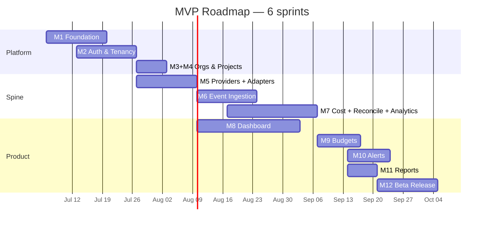
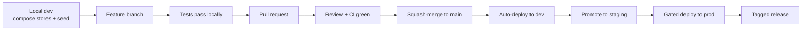

# AI FinOps — Software Design Document (SDD)
## Chapter 6: MVP Implementation Roadmap & Engineering Execution Plan

| Field | Value |
|---|---|
| **Document title** | AI FinOps — Software Design Document |
| **Chapter** | 6 — MVP Implementation Roadmap & Engineering Execution Plan |
| **Version** | 0.1 (Draft) |
| **Status** | Draft for Review |
| **Author** | Khan — Founder |
| **Last updated** | June 26, 2026 |
| **Depends on** | Chapters 1–5 |
| **Feeds** | Sprint 0 kickoff; the engineering backlog |

> **Purpose.** Chapters 1–5 define *what the system is*. This chapter defines *what to build first, in what order, and why* — the execution blueprint a small team reads and then starts building. It is not architecture. It contains **no code, no Dockerfiles, no SQL, no YAML.** Every decision is tied back to the binding criteria already set: the MVP scope (§2.3), the V1 acceptance criteria (SC-1…SC-10, §2.9), the SLOs (§4.24), and the service and contract definitions (Chapters 3–5). New decisions are recorded as **ADR-044 and ADR-045**.

---

## 6.1 MVP Philosophy

**What MVP means for AI FinOps.** The MVP is the smallest product that proves the **accuracy wedge** (Phase 1, §1.4): a design partner can connect OpenAI and Anthropic, see **reconciled** cost **attributed to projects** on a dashboard, set a budget, and receive an alert. Its job is to validate that finance and engineering teams *trust the numbers* and will pay — not to be feature-complete. The trust gate is accuracy (±2%, SC-3), not feature count.

**Target vs MVP architecture.** The MVP runs the *same logical architecture* as the target, pragmatically collapsed. Critically, every simplification collapses a **deployment or operations choice — never a core seam**:

| Concern | Target architecture | MVP architecture | Why deferred |
|---|---|---|---|
| Deployment | 12+ independent services | 4 co-located units: `api` / `ingest` / `workers` / `jobs` (§3.10.2) | Fewer moving parts; boundaries preserved for later split |
| Service comms | gRPC mesh + mTLS | In-process calls; simple internal auth | gRPC mesh is unnecessary while co-located |
| Event bus | Kafka cluster | Single-broker **Redpanda** | Kafka-API-compatible; simpler ops; self-hostable |
| OLAP | Sharded ClickHouse cluster | Single ClickHouse node | MVP volume (§4.14) needs no sharding |
| Workflows | Temporal | **cron + queue** | YAGNI until backfill complexity grows (ADR-014) |
| External API | REST + GraphQL | **REST only** | GraphQL deferred; REST covers V1 (scopes ADR-011) |
| Regions | Multi-region + residency | **Single region (US)** | Enterprise/EU concern (ADR-018) |
| Erasure | Crypto-shred implemented | Design hook only | US-first; build at EU/enterprise (ADR-020) |
| Delivery model | SaaS + self-host | **Managed SaaS** | Stay self-hostable; ship self-host later (PP-4) |
| Providers | Many | **OpenAI + Anthropic** | Highest-spend; prove the adapter framework |

**The preserved seams** — event-driven pipeline (§AP-1), single-writer ownership (§3.5), adapter plugins (§AP-4), immutable archive (§3.8.1), and the frozen canonical event (§4.26) — are all retained. Because of this, **scaling is configuration, not rewrite**: more partitions, more shards, more workers, splitting co-located units apart. *Recorded as ADR-044 (MVP architecture simplifications).*

**Why deferral is correct.** Deferred items are *additive layers on a sound foundation*, not core changes (the §2.3 discipline). Building them before validation would spend a small team's runway ahead of demand (PP-9).

**Execution principles:**
- **Fast validation** — build a thin vertical slice (walking skeleton) to first reconciled cost as early as possible, then thicken.
- **Small-team execution** — minimize moving parts; managed infrastructure; the fewest languages the team is fastest in.
- **Customer feedback** — design partners drive priority; accuracy is the non-negotiable gate.
- **Technical-debt management** — only *deliberate, documented* shortcuts that preserve a seam are allowed. Each is logged in a **tech-debt register** with the trigger that requires revisiting it. Accidental debt and seam-closing shortcuts are not permitted.

---

## 6.2 MVP Goals

| ID | Goal | Priority | Business value | Acceptance criteria |
|---|---|---|---|---|
| **G1** | Create organization, invite users, enforce roles | Critical | Tenancy foundation | Org + user exist; RBAC + tenant isolation enforced (SC-8) |
| **G2** | Connect OpenAI | Critical | First provider | Credential stored encrypted, validated, connection healthy (SC-1) |
| **G3** | Connect Anthropic | Critical | Cross-provider proof | Same as G2 for a second provider |
| **G4** | Ingest usage (push + pull) | Critical | The core data | Events flow, idempotent, no double-count (SC-6); historical backfill works |
| **G5** | Dashboard shows reconciled cost by project | Critical | **The wedge** | p95 < 2s (SC-2); reconciled within ±2% (SC-3); provisional/reconciled shown (SC-7) |
| **G6** | Budget alerts | High | Governance | Threshold breach fires alert via email/webhook; no missed breaches (SC-4) |
| **G7** | Historical report / export | High | Finance deliverable | Deterministic, exportable, traceable report (SC-9) |
| **G8** | 15-minute onboarding | High | Time-to-value | Signup → first reconciled dashboard ≤ 15 min (SC-1) |
| **G9** | Trustworthy numbers; labeled estimates | Critical | Trust | Estimates explicitly labeled; figures reconcile (SC-10, P1) |

---

## 6.3 MVP Scope

| Category | Items | Rationale |
|---|---|---|
| **Included** | OpenAI + Anthropic adapters; adapter framework; push (Collector) + pull ingestion; normalization, costing, reconciliation; pricing catalog; project attribution; orgs/users/projects/RBAC/API keys; provider connections; budgets + threshold alerts (email + webhook); REST dashboard; deterministic report/export; onboarding flow; baseline monitoring + backups | Exactly what the first paying customer needs to see trusted, attributed, governed cost |
| **Deferred** *(post-MVP, architecture supports)* | GraphQL; gRPC mesh + mTLS; Temporal; multi-region; crypto-shred implementation; self-host packaging; Gemini/xAI; bulk NDJSON import; anomaly ML; forecasting; optimization/recommendations; SSO; billing; chargeback; agent monitoring | Additive layers on the MVP foundation; not required for first-customer validation |
| **Excluded** *(out of scope by design)* | LLM gateway; model provider; prompt management; observability replacement; browser scraping; unofficial-API dependence | The §2.2 non-goals — these would dilute focus or compromise trust |

Scope is anchored to **"first paying customer," not "complete platform."**

---

## 6.4 Engineering Roadmap (Milestones)

Twelve milestones in dependency order. The first demoable end-to-end path (the wedge) is reached at **M7 + M8**. Effort is indicative person-effort for a small team and assumes the frontend parallelizes against the Chapter 5 contracts.

| # | Milestone | Purpose | Key deliverables | Depends on | Exit criteria | Top risk | Effort |
|---|---|---|---|---|---|---|---|
| **M1** | Foundation | The platform everything sits on | Monorepo + CI skeleton; local/dev envs; provision Postgres, ClickHouse, Redpanda, Redis, object storage; shared `packages/` (event-schema, errors, contracts); service skeletons with health endpoints (§3.19) | — | A request flows through `api` with health/metrics; CI runs lint+test; dev env reproducible | Infra yak-shaving | ~1.5 sprints |
| **M2** | Authentication & Tenancy | Gate everything; establish the tenant | Identity service: orgs, users, RBAC, API keys (`sk_`/`ik_`), OAuth/OIDC, JWT/refresh | M1 | Login works; org exists; API-key auth + RBAC + tenant scoping enforced (SC-8) | Auth/security correctness | ~1 sprint |
| **M3+M4** | Organizations & Projects | Master-data + attribution | Org settings; projects; attribution mapping (API key → project) | M2 | Orgs/projects CRUD; attribution resolves | — | ~0.5 sprint |
| **M5** | Provider Connections + Adapter Framework | Connect the two providers; prove extensibility | Adapter contract (§5.11); OpenAI + Anthropic adapters; credential encryption; connection state machine (§3.21.1) | M2–M4 | Connect both providers; healthy state; **adapter fitness test** (new provider = adapter only, SC-5) | Provider API quirks; billing-endpoint availability (OQ-1) | ~1.5 sprints |
| **M6** | Event Ingestion | The heart — get events in, safely | Collector API (push, §5.10); pull workers (cron); Redpanda topics; raw archive; idempotency (Redis + `event_id`); DLQ; historical backfill | M5 | Push + pull events flow, archived, idempotent, **no double-count** (SC-6) | Dedup correctness; rate limits | ~1.5 sprints |
| **M7** | Normalization, Costing, Reconciliation & Analytics | **The wedge engine** | Normalization (dedup, attribution enrich, pricing resolve, cost compute); pricing catalog; ClickHouse costed events + rollup MVs; reconciliation (push vs pull, ±2%); Query service + analytics endpoints (§5.9) | M6 | Costed events in ClickHouse; rollups built; reconciliation within ±2% (SC-3); analytics p95 < 2s (SC-2) | Pricing accuracy; reconciliation logic; `event_id` determinism | ~2 sprints |
| **M8** | Dashboard | Make the wedge visible | Onboarding flow; provider-connect UI; cost dashboard (by provider/model/project, time-series, budget utilization); provisional/reconciled indicators | M7, M2 | Onboarding ≤ 15 min → reconciled cost shown (SC-1) | UX; perf | ~2 sprints (parallel) |
| **M9** | Budgets & Governance | Spend control | Budget CRUD; threshold evaluation (Governance consumes costed events); budget state machine (§3.21.2) | M7 | Budgets created; thresholds evaluated; transitions fire | — | ~1 sprint |
| **M10** | Alerts & Notification | Act before the invoice | Alert raising; Notification (email + webhook, HMAC signing §5.13); retry/backoff | M9 | Threshold breach → alert → delivered (SC-4) | Delivery reliability | ~1 sprint |
| **M11** | Reports | Finance deliverable | Reporting service; deterministic exports; artifacts to object storage | M7 | Generate + download report; traceable to source (SC-9) | — | ~0.5–1 sprint |
| **M12** | Beta Release | Make it real | Reconciliation/accuracy hardening; onboarding polish; docs (OpenAPI/SDK); platform monitoring; backups; security review; V1 checklist (§6.15) | All | V1 checklist green; design partners live | Accuracy under real data | ~1.5 sprints |

**Critical path:** M5 → M6 → M7 are the spine; **M7 is the highest-risk milestone** (it is the wedge engine and where accuracy is won or lost). The honest read: the 12-week plan holds *if M7 goes well*; budget buffer there before anywhere else.

---

## 6.5 Repository Structure

A **monorepo** (ADR-017), expanding §3.23, so shared contracts live in exactly one place and cross-cutting changes are atomic.

```text
ai-finops/
├── .github/               # CI/CD workflows, PR & issue templates, CODEOWNERS
├── docs/                  # SDD chapters, ADRs (docs/adr/), runbooks, API docs
├── frontend/              # dashboard application
├── backend/
│   ├── services/          # deployable units: api, ingest, workers, jobs
│   └── adapters/          # provider plugins (openai, anthropic, …)
├── packages/              # SHARED CONTRACTS — single source of truth
│   ├── event-schema/      #   canonical event + envelope (§4.3, §4.20)
│   ├── proto/             #   service interface definitions (§3.6)
│   └── errors/            #   common error model (§3.20, §5.7)
├── sdk/                   # client SDKs (per language)
├── deployment/            # Helm/K8s manifests, Terraform, local compose
├── scripts/               # dev + ops automation
├── tests/                 # cross-service / integration / contract / E2E tests
└── examples/              # adapter examples, SDK usage samples
```

| Folder | Why it exists |
|---|---|
| `.github/` | CI/CD, review automation, ownership (CODEOWNERS routes reviews) |
| `docs/` | The SDD and ADRs are the source of truth; runbooks for ops |
| `frontend/` | The dashboard; builds against §5 contracts independently |
| `backend/services/` | The four V1 deployable units (§3.10.2) |
| `backend/adapters/` | Provider plugins, isolated per §AP-4 (adding a provider touches only this) |
| `packages/` | The canonical event, contracts, and error model live once and are consumed everywhere — the mechanism that keeps §4.26's frozen contract from drifting |
| `sdk/` | Per-language SDKs sharing one logical contract (§5.12) |
| `deployment/` | Infra-as-code + local compose for reproducible environments |
| `scripts/` | Repeatable dev/ops tasks |
| `tests/` | Cross-service tests, including the SC-5 fitness test and acceptance suite |
| `examples/` | Lowers integration friction for adapter and SDK authors (§PP-8) |

---

## 6.6 Engineering Standards

| Area | Standard | Why |
|---|---|---|
| **Coding** | Language linters + formatters enforced in CI; no secrets in code; **money is decimal, never float** (§4.19) | Consistency; a money-correctness guardrail specific to a FinOps platform |
| **Branch strategy** | Trunk-based / GitHub Flow: `main` always deployable, short-lived feature branches | Continuous integration; avoids merge hell on a small team |
| **Commit convention** | Conventional Commits (`feat`/`fix`/`chore`/…) | Enables changelog and version automation |
| **Pull requests** | Small, single-purpose; ≥1 review; CI green; linked issue; template | Reviewability and traceability |
| **Definition of Done** | Code + tests + docs + review + CI green + deployed to dev + acceptance criteria met + ADR if architectural | A consistent, enforceable bar |
| **Code review checklist** | Correctness; tests; security (no secrets, input validation); contract conformance (schema/error model); money-decimal; tenant scoping; performance; docs | Catches the failure modes that matter most here |
| **Documentation** | OpenAPI generated/maintained from §5; ADRs for decisions; package READMEs; runbooks | The blueprint stays current; onboarding is fast |
| **Testing** | Per §6.12; coverage thresholds enforced in CI | Quality gate, focused on correctness-critical paths |

*Recorded as ADR-045 (engineering process standards).*

---

## 6.7 Sprint Plan

Six two-week sprints (~12 weeks). Frontend (M8) runs in parallel with backend from Sprint 3, building against the Chapter 5 contracts.



| Sprint | Objectives | Key tasks | Deliverables | Risk | Success criteria |
|---|---|---|---|---|---|
| **1** | Platform skeleton + auth foundation | M1; begin M2 | Repo, CI, dev env, stores provisioned, shared packages, service skeletons | Infra setup overrun | Request flows through `api`; CI green |
| **2** | Tenancy + entities + adapter framework begins | Finish M2; M3+M4; begin M5 | Auth, RBAC, orgs, projects, attribution | Auth correctness | Login + RBAC + tenant scoping work (SC-8) |
| **3** | Connect providers + ingest events | M5; M6; frontend scaffolding (M8) | Both adapters; Collector; pull workers; bus; archive; idempotency | Provider quirks; dedup | Both providers connected; events flow, no double-count (SC-6) |
| **4** | **The wedge** — reconciled cost visible | M7; M8 continues | Costing, reconciliation, ClickHouse rollups, analytics API; dashboard shows cost | **Reconciliation accuracy** | Reconciled within ±2% (SC-3); dashboard p95 < 2s (SC-2) |
| **5** | Governance + alerts + reports | M9; M10; M11; finish M8 | Budgets, threshold alerts, notifications, reports; onboarding flow | Alert reliability | Budget breach → alert delivered (SC-4); report exports (SC-9) |
| **6** | Harden + launch beta | M12 | Accuracy hardening, docs, monitoring, backups, security review | Accuracy under real data | V1 checklist green (§6.15); design partners onboarded ≤15 min (SC-1) |

The plan is deliberately aggressive; Sprint 4 is the one to protect.

---

## 6.8 Team Responsibilities

A seed-stage team wears multiple hats; the roles below are *responsibilities*, not necessarily distinct people.

| Role | Responsibilities | Owns |
|---|---|---|
| **Founder** | Architecture ownership; ADR ratification; the critical-path engine (ingestion/normalization hot path — leveraging Rust strength); product priority; design-partner relationships | M5–M7 core; technical direction |
| **Backend Engineer(s)** | Services per milestone (Identity, Collector, Governance, Query, Reporting, adapters); the event pipeline | M2, M5, M6, M9–M11 |
| **Frontend Engineer** | Dashboard, onboarding; builds against §5 contracts in parallel | M8 |
| **DevOps** *(often a founder/backend hat early)* | CI/CD, environments, infra provisioning, monitoring, backups | M1 infra; §6.10–§6.11 |
| **QA** *(embedded; engineers own their tests early)* | Test strategy; contract/E2E tests; **the ±2% reconciliation validation**; acceptance suite | §6.12; SC validation |
| **Product** *(often the founder)* | Roadmap; design-partner feedback; acceptance criteria; prioritization | Scope, KPIs |

**Coordination.** The SDD is the source of truth; the **Chapter 5 contracts and the shared `packages/` are what enable frontend, backend, and SDK to work independently** (the entire point of an API-first design). Cadence: daily async standup, weekly planning, milestone **exit criteria as gates**, ADRs for decisions. Be explicit about hat-wearing — a 3–4 person team will have the founder covering DevOps/Product initially; that is fine if the gates and contracts hold.

---

## 6.9 Development Workflow



| Stage | What happens | Gate |
|---|---|---|
| Local | Compose brings up stores + services; seed data | — |
| Feature | Branch from `main`; build against contracts | — |
| Testing | Unit + integration locally and in CI | Tests pass |
| Review | PR with ≥1 review | CI green + DoD |
| Merge | Squash to `main` (always deployable) | — |
| Deploy | `main` auto-deploys to dev; promote to staging; manual gate to prod | Staging validation |
| Release | Tagged release + changelog | Release approval |
| **Rollback** | Redeploy previous version; disable via feature flag; data safety via expand-contract + replay (§4.13) | — |
| **Bug fix** | Normal flow, prioritized | DoD |
| **Hotfix** | Branch from prod tag → fast-track review → deploy → backport to `main` | Expedited review + CI |

The rollback story is strong because of the data architecture: derived state rebuilds from the archive (§4.12), and migrations are expand-contract (§4.13), so a bad deploy is recoverable without data loss.

---

## 6.10 Environment Strategy

| Environment | Purpose | Configuration | Secrets | Data | Deploy trigger |
|---|---|---|---|---|---|
| **Local** | Individual dev | Compose; local config | `.env` (never committed) | Seed/synthetic | Manual |
| **Development** | Shared integration | Non-prod config | Non-prod creds | Synthetic | Auto from `main` |
| **Staging** | Pre-release validation | Prod-like | Vault/secrets-manager (non-prod) | Sanitized/synthetic | Manual promote |
| **Production** | Live | Prod config | KMS-backed secrets manager | Real customer data (encrypted, §4.15) | Gated |

Secrets are never in the repo; staging/production use a KMS-backed secrets manager and inject at runtime (§4.15, §5.16). Production data is encrypted and backed up (§4.12).

---

## 6.11 CI/CD Strategy

```mermaid
flowchart LR
    LINT[Lint + format] --> UT[Unit tests]
    UT --> BUILD[Build]
    BUILD --> IT[Integration + contract tests]
    IT --> SEC[SAST + secret scan]
    SEC --> DEP[Dependency + license scan]
    DEP --> IMG[Container build]
    IMG --> DDEV[Deploy dev - auto]
    DDEV --> DSTG[Deploy staging - gated]
    DSTG --> DPROD[Deploy prod - gated]
```



| Stage | Purpose |
|---|---|
| Lint + format | Style consistency; fail fast |
| Unit tests | Core-logic correctness |
| Build | Compilation/build validation |
| Integration + contract | Service-store integration; **schema-compatibility gate (§4.26)** and **adapter fitness test (SC-5)** |
| SAST + secret scan | Static security analysis; block committed secrets |
| Dependency + license scan | Known-vuln and license compliance |
| Container build | Produce deployable images |
| Deploy (dev/staging/prod) | Dev auto; staging and prod gated; readiness verified via `/ready` (§3.19) |

The contract gates (schema compatibility, adapter fitness) are what mechanically enforce the architecture in CI rather than relying on reviewer memory.

---

## 6.12 Testing Strategy

| Test type | Scope | When | Target |
|---|---|---|---|
| **Unit** | Pure logic: costing math, `event_id` keying, threshold eval | Every commit | ≥ 80% on core logic |
| **Integration** | Service + its stores (e.g., Normalization → ClickHouse) | CI | Critical integrations covered |
| **Contract** | Consumer-driven; schema + error-model conformance; adapter contract | CI | 100% of published contracts |
| **API** | Endpoint behavior vs §5 | CI | All V1 endpoints |
| **End-to-end** | The wedge path: connect → ingest → reconcile → dashboard → budget → alert | Pre-release | Happy path + key failures |
| **Load** | Ingestion throughput; dashboard p95 < 2s at target volume (§4.14) | Pre-release | Meets SLOs |
| **Performance** | Query latency; reconciliation completion (§4.24) | Pre-release | Meets SLOs |
| **Security** | AuthZ/tenancy isolation; secret handling; input validation; threat model (§5.16) | Pre-release | No criticals |
| **Acceptance** | SC-1…SC-10 as executable checks | Pre-release | All pass = V1 done |

**Coverage philosophy:** correctness- and money-critical paths — **costing, reconciliation, idempotency, tenancy** — target ~100% branch coverage; the rest targets a pragmatic ≥80%. Chasing 100% everywhere is overengineering (PP-9); chasing it on the money paths is non-negotiable.

---

## 6.13 MVP Risks

| Risk | Category | Likelihood | Impact | Mitigation | Owner |
|---|---|---|---|---|---|
| Reconciliation misses ±2% | Technical | Medium | High | Push+pull duality + validation suite; treat as a release gate (SC-3) | Founder |
| Provider lacks granular billing API | Technical | High | Medium | Degrade to coarse true-up; surface the limitation (OQ-1) | Backend |
| `event_id` determinism bug → double-count | Technical | Medium | High | Contract + replay tests; freeze the derivation (§4.3) | Backend |
| Scope creep into target architecture | Technical | Medium | High | Deferral discipline + tech-debt register (§6.1) | Founder |
| Slow design-partner validation / weak willingness-to-pay | Business | Medium | High | Tight feedback loop; pick partners with real multi-provider spend | Product |
| Incumbent enters the wedge | Business | Medium | Medium | Win on depth + accuracy before they generalize | Founder |
| Small-team velocity / bus factor | Operational | High | Medium | Docs, contracts, simplicity, co-location | Founder |
| Infra ops burden | Operational | Medium | Medium | Managed services; Redpanda; single-node stores | DevOps |
| Credential breach | Security | Low-Med | High | Envelope encryption; ingestion-key scope limiting (§5.3) | DevOps |
| Tenancy isolation bug | Security | Medium | High | Tenancy test suite; enforced org-scoping (§4.15) | Backend |
| Building the wrong thing / over-featuring | Product | Medium | High | MVP discipline; design-partner-driven priority | Product |
| Trust failure from one wrong number | Product | Medium | High | Accuracy gate + labeled estimates (SC-10) | Founder |

---

## 6.14 Success Metrics (KPIs)

| KPI | Target | Source |
|---|---|---|
| Customer onboarding time | ≤ 15 min | SC-1 |
| Dashboard query latency | p95 < 2 s | SC-2, §4.24 |
| API latency | p95 < 300 ms (non-analytics) | §4.24 |
| Event processing latency (ingest → costed) | p95 < 5 s | §4.24 |
| Dashboard freshness | < 30 s | §4.24 |
| Cost accuracy (reconciled vs billing) | within ±2% | SC-3 |
| Budget alert latency | < 60 s | §4.24 |
| Provider sync success rate | ≥ 99% | Operational |
| Design partners onboarded (beta) | target set with Product | Business |
| Activation (provider connected + budget set < 24h) | ≥ 70% | §1.7 |

---

## 6.15 Version 1 Release Checklist

| ✓ | Item | Owner | Reference |
|---|---|---|---|
| ☐ | Authentication & RBAC complete | Backend | M2, SC-8 |
| ☐ | Organizations & Projects complete | Backend | M3+M4 |
| ☐ | Provider adapters (OpenAI + Anthropic) complete | Backend | M5, SC-5 |
| ☐ | Ingestion + reconciliation complete (±2%) | Backend | M6–M7, SC-3/6 |
| ☐ | Dashboard complete (onboarding ≤15 min) | Frontend | M8, SC-1/2 |
| ☐ | Budgets + alerts complete | Backend | M9–M10, SC-4 |
| ☐ | Reports/export complete | Backend | M11, SC-9 |
| ☐ | Documentation complete (OpenAPI + SDK) | All | §6.6 |
| ☐ | Testing complete (acceptance SC-1…SC-10) | QA | §6.12 |
| ☐ | Deployment (production) complete | DevOps | §6.10 |
| ☐ | Monitoring/observability complete | DevOps | §3.11 |
| ☐ | Backups + DR validated | DevOps | §4.12 |
| ☐ | Security review complete | DevOps/Backend | §5.16 |
| ☐ | Estimates labeled; no number presented as exact | Founder | SC-10 |

---

## 6.16 Version 2 Roadmap

Clearly separated future work, additive on the MVP foundation (mapped to the §1.4 phases):

| V2 item | Phase | Depends on |
|---|---|---|
| Additional providers (Gemini, xAI) | 2 | Adapter framework (built) |
| Cursor / Claude Code (per-seat sources) | 2 | Adapter framework; subscription ingestion |
| Multi-cloud AI (Bedrock, Azure OpenAI, Vertex) | 2 | Adapter framework |
| Forecasting | 2 | Reconciled historical data |
| Anomaly detection | 2 | Analytics + history |
| Chargeback / showback | 2 | Attribution (built) |
| Enterprise SSO (SAML/SCIM) | 3 | Identity service |
| Multi-region + residency; crypto-shred implementation | 3 | ADR-018/020 ratification |
| Self-host GA | 3 | No managed-only deps (preserved) |
| AI recommendations / optimization engine | 3 | Accurate data + benchmarking |
| Agent monitoring (agent-level economics) | 3–4 | Event model (supports it) |
| Billing engine | 4 | Out of MVP by design (§2.3) |
| GraphQL; gRPC mesh; Temporal | 2–3 | Scale/feature triggers |

None of these is a rewrite; each is a layer or a configuration change enabled by the preserved seams (§6.1).

---

## 6.17 Open Questions

| ID | Question |
|---|---|
| **OQ-E1** | MVP language choice — single language for velocity vs polyglot now (ADR-012). |
| **OQ-E2** | Timing of the cron+queue → Temporal transition (ADR-014). |
| **OQ-E3** | When to split the co-located units into independent services (volume trigger). |
| **OQ-E4** | Reconciliation degraded mode for providers without granular billing (OQ-1). |
| **OQ-E5** | Pricing-catalog maintenance process — how prices are kept current (manual, feed, or provider-published). |
| **OQ-E6** | Final `event_id` determinism specification (gating §4.3). |
| **OQ-E7** | Exact coverage thresholds per package. |
| **OQ-E8** | Number of design partners required to declare beta success. |
| **OQ-E9** | Multi-currency timing (inherits OQ-5 from §4.18). |
| **OQ-E10** | GraphQL introduction timing relative to dashboard needs. |

---

## Implementation Readiness Checklist

| ✓ | Item | Status | Reference |
|---|---|---|---|
| ✓ | Architecture approved | Complete | Chapter 3 |
| ✓ | Database/data model ready | Complete | Chapter 4 |
| ✓ | API contracts ready | Complete (V1 surface) | Chapter 5 |
| ✓ | Repository structure ready | Complete | §6.5 |
| ✓ | Sprint plan ready | Complete | §6.7 |
| ✓ | Testing strategy ready | Complete | §6.12 |
| ✓ | CI/CD ready | Complete | §6.11 |
| ✓ | Security ready | Defined; review is a release gate | §5.16, §6.15 |
| ◐ | **Ready to start development** | **Yes — pending Sprint 0 ratification of Proposed ADRs (012 language, 014 workflows, 018 multi-region) and the pricing-source decision (OQ-E5)** | §6.17 |

**Verdict.** The team can begin building immediately. The only items between this document and the first commit are a short **Sprint 0** to ratify the three Proposed ADRs and decide the pricing-catalog maintenance process — none of which blocks M1 (Foundation), which can start in parallel.

---

_End of Chapter 6 — and of the AI FinOps Software Design Document v0.1. The six chapters form a complete path from market thesis (Ch1) through principles (Ch2), architecture (Ch3), data (Ch4), and API contracts (Ch5) to this execution plan. New decisions are recorded as ADR-044 and ADR-045 in the register (§3.24)._
